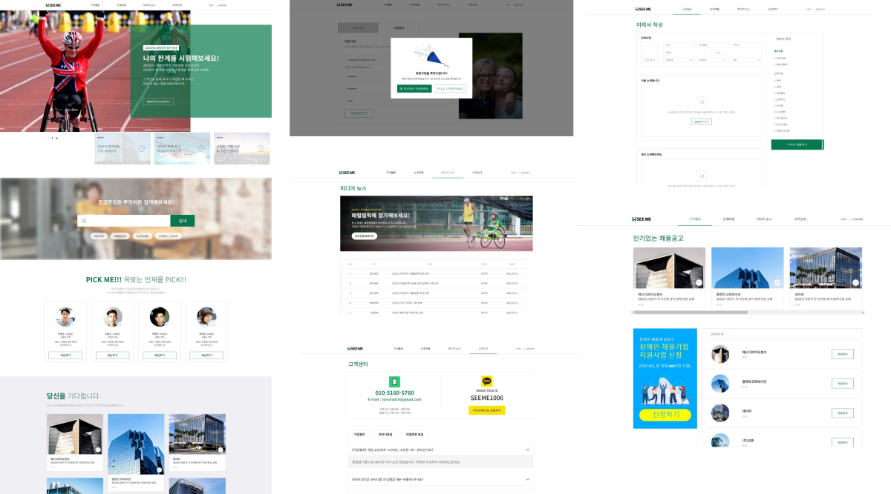
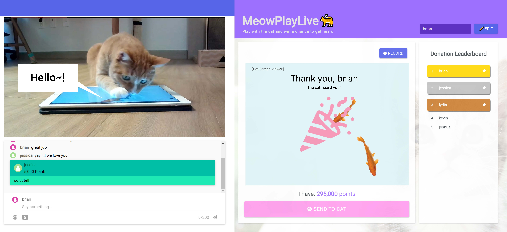
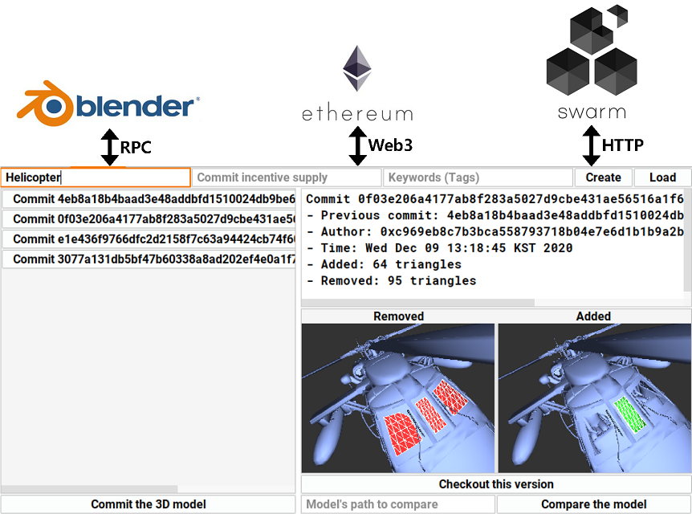
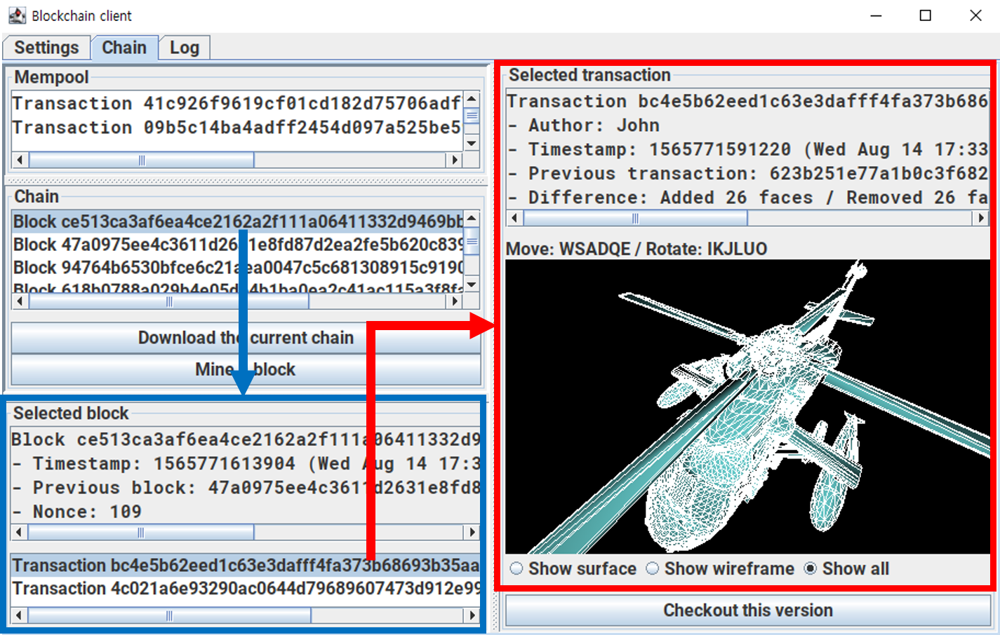

### [여기서](README.md) 한국어 버전을 보실 수 있습니다!

## 🧑‍💼 Careers

### [TmaxOffice](https://www.tmax.co.kr/tmaxoffice)

Researcher (2021.03 ~)

ToOffice

Office suite for desktop

- Ribbon UI maintenance
- Implement trial mode
- Create library based on the product

SuperUX

Drag-and-drop based app development platform

- Construct and main development & build environment
- Create library for this product and other products
- Create base classes and components used internally
- Implement toolpane UI
- Implement view composition feature

Visit "Projects" section below to see the details of the products :)

## 🎨 Projects

### SeeMe (2022.01 ~ 2022.06)

Recruitment service for people with disabilities, developed for [TimeBanks Korea](http://www.timebanks.or.kr/)

[**Code**](https://github.com/volunteer-project-1/volunteer_client)

<react/>

<strong>Technologies</strong>

- TypeScript
- SCSS
- React
- Redux Toolkit
- Next.js
- [react-scoped-css](https://github.com/gaoxiaoliangz/react-scoped-css)
  - For Vue-like [scoped CSS](https://vue-loader.vuejs.org/guide/scoped-css.html)
- [MUI (Material UI)](https://mui.com/)
  - For implementing modals easily
- [Serverless](https://github.com/serverless-nextjs/serverless-next.js)
  - For deployment
- GitHub actions
  - For automatic deployment

<strong>Features</strong>

For all users 모든 사용자

- Landing page 랜딩 페이지
- Media news page 미디어 뉴스 페이지
- FAQ page FAQ 페이지

For job seekers 구직자

- Resume editor page 이력서 편집 페이지
- Company list page 회사 목록 페이지

For companies 회사

- Company info editor page 회사 정보 편집 페이지
- Job info editor page 채용 정보 편집 페이지
- Seeker list page 구직자 목록 페이지

<strong>Results</strong>

- Delivered the prototype to the organization and performed QA process  
  기관 측에 프로토타입 전달 및 QA 진행
- Gained experience of developing website with many pages  
  많은 페이지를 가진 웹사이트 개발 경험을 얻음

### SuperUX (2021.06 ~)

Drag-and-drop based app creation program  
드래그 앤 드롭 기반 앱 제작 프로그램

<react/><electron/>

<strong>Technologies</strong>

- TypeScript
- SCSS
- React
- MobX
- React Router
- i18next
  - For resource loading and internalization
- axios
- Webpack
- MUI
- Jest
- Storybook
- ESLint
- StyleLint
- Electron
  - For generating a desktop application

### ToOffice (2021.03 ~ 2021.05)

Office suite for Windows and TmaxOS  
윈도우 및 TmaxOS 환경을 위한 오피스 프로그램

<strong>Technologies</strong>

- C++
- WinAPI

### MeowPlayLive (2021.07 ~ 2021.11)

Interaction game for cat and streamer + Donation & chat system for viewers  
고양이와 스트리머를 위한 상호작용 게임 + 시청자를 위한 도네이션 및 채팅 시스템

[**Code**](https://github.com/cheeeunahn/meowplaylive)

<react/>![Emotion](https://img.shields.io/badge/Emotion-C346A8?style=for-the-badge&logo=data:image/png;base64,iVBORw0KGgoAAAANSUhEUgAAABQAAAAUCAYAAACNiR0NAAAAAXNSR0IArs4c6QAAAARnQU1BAACxjwv8YQUAAAAJcEhZcwAADsMAAA7DAcdvqGQAAARlSURBVDhPdZRrbFNlGMf/59Lbabeu3UrXrRubsG7sXqVgAkNFmBNYFi9BISEGNUqMErN4+UDwgxE/gMagqMEL0RhJTMShAY0ajG7GOQSWXUq3zq6zq3SM9d61PT3tOZ4dTqq14ZecvG+e93n+5/++73MOgVtw8qnj5U1E/WkVqeoCAZ6n+BmW4n4KKG98tPfoEy45rYhbCn722MevdmjXHib+l5KjeD6qTnw4khl78aXjh+JyOE+R4NTUFDH75tjRLCv0U6DJGt2q4iQxkGJYl1PwdO9/44BfjkpQ8phnW/rOZ+uU1tdKFAzhjHkQYVNQkBQYWiVn3ETB0SaDQr+zfWP76e9+/yElh0HKYx4TbTy4MvICjztalqFqOIfJuA/u2H+MiA4JpVi6zDe2U01H5KhEgeCxY0d1CoFuWJkvJJdgqA4AzQZk3WEEkyH40ouI55ZBqigIHI9YSeoaG8088N4zb1klAZECQYqgqZVLWMxcR1j7K1y6MELvdqI5WALKG4E/dxkLbBDJZAqCAjAL5VWzpP8VRYLeJ0sUCva/0B/lwCVY42+wrP8DXw9YUOVLSmuOvouwbxlEgp7CSGQYS6kwiAzQUmNTTdDTH0hJIkVnKBDwKg0B/LVgQYhzY3zTJJLqOMatZcgQClyITGMmOodIKgE2mxH3Q1BvnzoRlMuLBTM8N/rLQifquUfQU9eAezv64NxJoKfRhWbHNnRvpGBzBCWHaYKDN+YbkkslitpmTVXjo51lqVa15yp0P67BUFUUTz58BiZ1GprsBNrqFmEui2DYSUFFmL7Yc2L/O3KpRIHDgzue74klUrtvXCuH/1I1Bvt02PPQWWiFBKLJf9ubEKdh8eKG58eW5FCevODTuw/UCJywl6XZM/5YGKN2HvfvOIvK7CKuDAhwngPioZuiV92lQMgGZLHvuQcPVkpBmfyWLzsvxTpbOobVrOYwRdIGVktjQqGG3fQ3atfmULE6C62BwJezTbg8eI/YMjrcoIOHCJ7QX3SPXJVlCs9ww7qNjtqK+u7JrZ0mt60SgbQR80skzLxfbGwKX7nrcIrfj+vbN0FvKMeWTJlBaaaOfDv8/c3eEik4Q7ve5vA2V6tIs0nQtLWBrLZie6Ub6xtzaK3nsb4iAIYhQTIMfGYGMxrCYY4bT8rlEnmHr7/8ydaWrNmumw+VVDt9xlWuOVW6xgyKDKKrYhZK8csY9FuwyHVh87lRdIzNww4LSmlt7d1d9xlzZuXI9LSTzTtU55SP5xhdv8PQtKVDv7bUtszgrm8mMDfeCk+4BH5x66NTm7H5wgxu582w2qehpdWIkoTWx2Z2dVs3MCs6eYdqZcYUr63Z1cqWQkOpxL7TQ00pobkewwwHzPnV0P/ZhHX61ahQl4o/Bhe4aD1+jk3g/JVPqQSTen9y0hmXBHt7e83XQoGBUMCr4RvXwcZqpZesOGDEx7tAIxe04DaVFRbGKK0RkSo4+TDOj3+OWCahUSiUYY/HM/QPnwGrCh3ur7kAAAAASUVORK5CYII=&logoColor=FFFFFF)

<strong>Technologies</strong>

- TypeScript
- React
- Emotion
- MUI
- Node.js
- Express
- Socket.io
  - Enables server to notify the clients
  - Necessary for implementing chat, etc.
- [NeDB](https://github.com/louischatriot/nedb)
- Webpack
- [p5.js](https://p5js.org/)

### MeshChain (2020.01 ~ 2021.01)

3D model and intellectual property management system based on decentralized technologies  
탈중앙화 기술 기반의 3D 모델 및 지적 재산권 관리 시스템

[**Code**](https://github.com/Avantgarde95/MeshChain-publish)

<strong>Technologies</strong>

- Kotlin
- Swing
  - GUI framework
- JOGL (OpenGL)
  - For 3D rendering
- Web3
- Ethereum (Geth)
- Solidity
- [Swarm](https://github.com/ethersphere/swarm)
  - For storing large data
- Blender
- JavaScript

### C3DMB (2018.12 ~ 2020.04)

3D modeling collaboration system based on blockchain  
블록체인 기반 3D 모델링 협업 시스템

[**Code**](https://github.com/Avantgarde95/C3DMB)

<strong>Technologies</strong>

- Kotlin
- Swing
- JOGL (OpenGL)
- Blender

## 🏫 Education

KAIST - M.S. in School of Computing 전산학부 석사 (2013 ~ 2018)

KAIST - B.S. in School of Computing and Department of Mathematical Sciences 전산학부 및 수리과학과 학사 (2018 ~ 2021)

## 📖 Research

### Collaborative 3D modeling system based on blockchain

<strong>Abstract</strong>

We propose a collaborative 3D modeling system, which is based on the blockchain technology. Our approach uses the blockchain to communicate with modeling tools and to provide them a decentralized database of the mesh modification history. This approach also provides a server-less version control system: users can commit their modifications to the blockchain and checkout others' modifications from the blockchain. As a result, our system enables users to do collaborative modeling without any central server.

- Hunmin Park and Sung-Eui Yoon
- [Homepage](https://avantgarde95.github.io/C3DMB/)
- [Code](https://github.com/Avantgarde95/C3DMB)
- Presented at: [Pacific Graphics, 2019 (Poster)](http://pg19.org/)

### MeshChain: Secure 3D model and intellectual property management powered by blockchain technology

<strong>Abstract</strong>

The intellectual value of digitized 3D properties in scientific, artistic, historical, and entertaining domains is increasing. However, there has been less attention on designing an immutable, secure database for their management. We propose a secure 3D property management platform powered by blockchain and decentralized storage. The platform connects various 3D modeling tools to a decentralized network-based database constructed on blockchain and decentralized storage technologies and provides the commit and checkout of the 3D model to that network. This structure provides 3D data protection from damages and attacks, intellectual property (IP) management, and data source authentication. We analyze its performance and show its applications to cooperative 3D modeling and IP management.

- Hunmin Park, Yuchi Huo and Sung-Eui Yoon
- [Code](https://github.com/Avantgarde95/MeshChain-publish)
- Presented at: [CGI (Computer Graphics International) 2021](http://www.cgs-network.org/cgi21/program/)
- Published at: [Springer LNCS (Lecture Notes in Computer Science)](https://link.springer.com/chapter/10.1007/978-3-030-89029-2_40)
