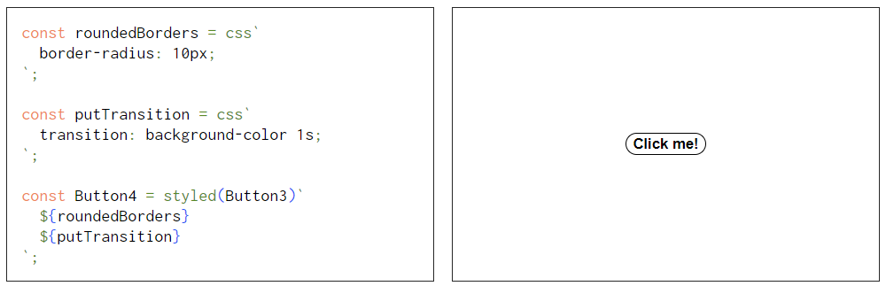
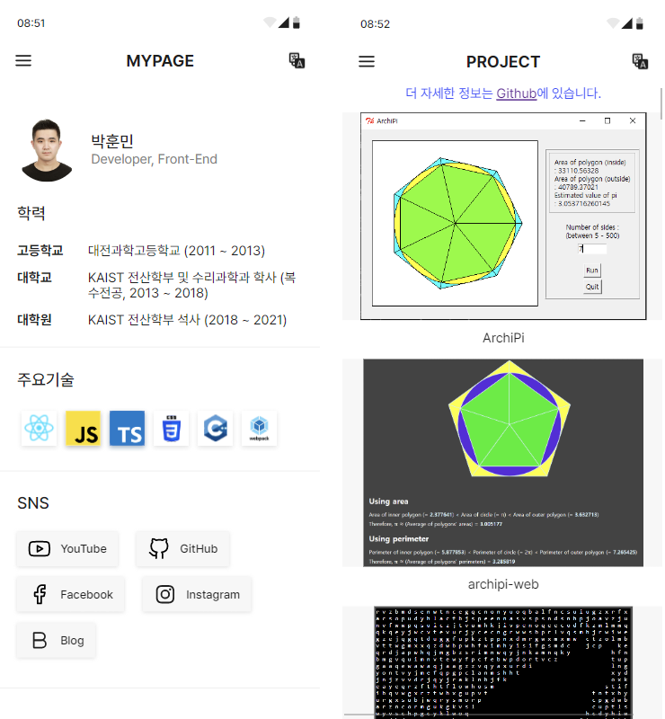

### [여기서](README.md) 한국어 버전을 보실 수 있습니다!

## 🖥️ Main technologies

|Technology|About|
|--|--|
||I can implement the UIs we need. I have experience implementing common components used by multiple people. I can manage the components by using the hooks and external state management tools properly.  |
||I'm familiar with both the latest and the old versions of JavaScript. I can use DOM APIs and other browser APIs, too.|
||I'm using it actively in web development. I can construct extendable and safe interfaces using union, intersection, generics, etc.|
||I can create the layouts and effects we need. I am familiar with animations, too. I prefer to use the methods such as CSS modules, SCSS, or CSS-in-JS to write the styles efficiently.  ![Emotion](https://img.shields.io/badge/Emotion-C346A8?style=for-the-badge&logo=data:image/png;base64,iVBORw0KGgoAAAANSUhEUgAAABQAAAAUCAYAAACNiR0NAAAAAXNSR0IArs4c6QAAAARnQU1BAACxjwv8YQUAAAAJcEhZcwAADsMAAA7DAcdvqGQAAARlSURBVDhPdZRrbFNlGMf/59Lbabeu3UrXrRubsG7sXqVgAkNFmBNYFi9BISEGNUqMErN4+UDwgxE/gMagqMEL0RhJTMShAY0ajG7GOQSWXUq3zq6zq3SM9d61PT3tOZ4dTqq14ZecvG+e93n+5/++73MOgVtw8qnj5U1E/WkVqeoCAZ6n+BmW4n4KKG98tPfoEy45rYhbCn722MevdmjXHib+l5KjeD6qTnw4khl78aXjh+JyOE+R4NTUFDH75tjRLCv0U6DJGt2q4iQxkGJYl1PwdO9/44BfjkpQ8phnW/rOZ+uU1tdKFAzhjHkQYVNQkBQYWiVn3ETB0SaDQr+zfWP76e9+/yElh0HKYx4TbTy4MvICjztalqFqOIfJuA/u2H+MiA4JpVi6zDe2U01H5KhEgeCxY0d1CoFuWJkvJJdgqA4AzQZk3WEEkyH40ouI55ZBqigIHI9YSeoaG8088N4zb1klAZECQYqgqZVLWMxcR1j7K1y6MELvdqI5WALKG4E/dxkLbBDJZAqCAjAL5VWzpP8VRYLeJ0sUCva/0B/lwCVY42+wrP8DXw9YUOVLSmuOvouwbxlEgp7CSGQYS6kwiAzQUmNTTdDTH0hJIkVnKBDwKg0B/LVgQYhzY3zTJJLqOMatZcgQClyITGMmOodIKgE2mxH3Q1BvnzoRlMuLBTM8N/rLQifquUfQU9eAezv64NxJoKfRhWbHNnRvpGBzBCWHaYKDN+YbkkslitpmTVXjo51lqVa15yp0P67BUFUUTz58BiZ1GprsBNrqFmEui2DYSUFFmL7Yc2L/O3KpRIHDgzue74klUrtvXCuH/1I1Bvt02PPQWWiFBKLJf9ubEKdh8eKG58eW5FCevODTuw/UCJywl6XZM/5YGKN2HvfvOIvK7CKuDAhwngPioZuiV92lQMgGZLHvuQcPVkpBmfyWLzsvxTpbOobVrOYwRdIGVktjQqGG3fQ3atfmULE6C62BwJezTbg8eI/YMjrcoIOHCJ7QX3SPXJVlCs9ww7qNjtqK+u7JrZ0mt60SgbQR80skzLxfbGwKX7nrcIrfj+vbN0FvKMeWTJlBaaaOfDv8/c3eEik4Q7ve5vA2V6tIs0nQtLWBrLZie6Ub6xtzaK3nsb4iAIYhQTIMfGYGMxrCYY4bT8rlEnmHr7/8ydaWrNmumw+VVDt9xlWuOVW6xgyKDKKrYhZK8csY9FuwyHVh87lRdIzNww4LSmlt7d1d9xlzZuXI9LSTzTtU55SP5xhdv8PQtKVDv7bUtszgrm8mMDfeCk+4BH5x66NTm7H5wgxu582w2qehpdWIkoTWx2Z2dVs3MCs6eYdqZcYUr63Z1cqWQkOpxL7TQ00pobkewwwHzPnV0P/ZhHX61ahQl4o/Bhe4aD1+jk3g/JVPqQSTen9y0hmXBHt7e83XQoGBUMCr4RvXwcZqpZesOGDEx7tAIxe04DaVFRbGKK0RkSo4+TDOj3+OWCahUSiUYY/HM/QPnwGrCh3ur7kAAAAASUVORK5CYII=&logoColor=FFFFFF)|
||I can construct development & build environment I need. I have experience in setting up not only applications but also libraries.|
||I can develop and build the application for various environments such as Windows and Linux. I prefer to minimize code duplications by utilizing function overloading, templates, etc.  |

## 🎨 Featured projects

### SeeMe (2022.01 ~ 2022.06)

Recruitment service for people with disabilities

This is a talent donation project started from the proposal of [TimeBanks Korea](http://www.timebanks.or.kr/). The project is run by a team of 2 frontend developers, 2 backend developers, and 2 designers.

The service currently provides the following features. We are doing QA with the organization and planning & developing additional features.

- Login as job seeker
  - Edit resume
  - See companies' information
- Login as company
  - Edit company information
  - Edit job information
  - See job seekers' information
- Common
  - Media news
  - FAQ

<strong>My role</strong>

I implemented login & registration page, and also developed inner pages such as resume & company info editor, job seeker & company info viewer. I also participated in some parts of the landing page.

<strong>Technologies</strong>

- TypeScript
- SCSS
- React
- Redux Toolkit
- Next.js
- [react-scoped-css](https://github.com/gaoxiaoliangz/react-scoped-css)
  - For Vue-like [scoped CSS](https://vue-loader.vuejs.org/guide/scoped-css.html)
- [MUI (Material UI)](https://mui.com/)
  - For implementing modals easily
- [Serverless](https://github.com/serverless-nextjs/serverless-next.js)
  - For deployment
- GitHub actions
  - For automatic deployment

### Tmax SuperUX (2021.06 ~)

No-code app development program

<strong>My role</strong>

I setup and maintained development & build environment of the project. I was mainly responsible for the development of the base classes and common components used throughout the project. I created a feature for users to create new views by composing existing views. I also developed a common library used by this project and other projects.

<strong>Technologies</strong>

- TypeScript
- SCSS
- React
- MobX
- React Router
- i18next
  - For resource loading and internalization
- axios
- Webpack
- MUI
- Jest
- Storybook
- ESLint
- StyleLint
- Electron
  - For generating a desktop application

### MeowPlayLive (2021.07 ~ 2021.11)

Web interface that enables cat live stream viewers to interact with the cat

Created for the paper [MeowPlayLive: Enhancing Animal Live Streaming Experience Through Voice Message-Based Real-Time Viewer-Animal Interaction](https://dl.acm.org/doi/abs/10.1145/3532106.3533553) presented at [DIS 2022](https://dis.acm.org/2022/).

This project was carried out by two people (Me and lead author), and it was created for the experiment to be used in the above paper. It provides the following features.

- Interface for the cat
  - Touch game for the cat
- Interface for the viewer
  - See the progress of the game in real time
  - Record the viewer's voice and sending it to the cat after spending some points
  - Ranking according to the amount of spent points
  - Chat between the viewers

![Emotion](https://img.shields.io/badge/Emotion-C346A8?style=for-the-badge&logo=data:image/png;base64,iVBORw0KGgoAAAANSUhEUgAAABQAAAAUCAYAAACNiR0NAAAAAXNSR0IArs4c6QAAAARnQU1BAACxjwv8YQUAAAAJcEhZcwAADsMAAA7DAcdvqGQAAARlSURBVDhPdZRrbFNlGMf/59Lbabeu3UrXrRubsG7sXqVgAkNFmBNYFi9BISEGNUqMErN4+UDwgxE/gMagqMEL0RhJTMShAY0ajG7GOQSWXUq3zq6zq3SM9d61PT3tOZ4dTqq14ZecvG+e93n+5/++73MOgVtw8qnj5U1E/WkVqeoCAZ6n+BmW4n4KKG98tPfoEy45rYhbCn722MevdmjXHib+l5KjeD6qTnw4khl78aXjh+JyOE+R4NTUFDH75tjRLCv0U6DJGt2q4iQxkGJYl1PwdO9/44BfjkpQ8phnW/rOZ+uU1tdKFAzhjHkQYVNQkBQYWiVn3ETB0SaDQr+zfWP76e9+/yElh0HKYx4TbTy4MvICjztalqFqOIfJuA/u2H+MiA4JpVi6zDe2U01H5KhEgeCxY0d1CoFuWJkvJJdgqA4AzQZk3WEEkyH40ouI55ZBqigIHI9YSeoaG8088N4zb1klAZECQYqgqZVLWMxcR1j7K1y6MELvdqI5WALKG4E/dxkLbBDJZAqCAjAL5VWzpP8VRYLeJ0sUCva/0B/lwCVY42+wrP8DXw9YUOVLSmuOvouwbxlEgp7CSGQYS6kwiAzQUmNTTdDTH0hJIkVnKBDwKg0B/LVgQYhzY3zTJJLqOMatZcgQClyITGMmOodIKgE2mxH3Q1BvnzoRlMuLBTM8N/rLQifquUfQU9eAezv64NxJoKfRhWbHNnRvpGBzBCWHaYKDN+YbkkslitpmTVXjo51lqVa15yp0P67BUFUUTz58BiZ1GprsBNrqFmEui2DYSUFFmL7Yc2L/O3KpRIHDgzue74klUrtvXCuH/1I1Bvt02PPQWWiFBKLJf9ubEKdh8eKG58eW5FCevODTuw/UCJywl6XZM/5YGKN2HvfvOIvK7CKuDAhwngPioZuiV92lQMgGZLHvuQcPVkpBmfyWLzsvxTpbOobVrOYwRdIGVktjQqGG3fQ3atfmULE6C62BwJezTbg8eI/YMjrcoIOHCJ7QX3SPXJVlCs9ww7qNjtqK+u7JrZ0mt60SgbQR80skzLxfbGwKX7nrcIrfj+vbN0FvKMeWTJlBaaaOfDv8/c3eEik4Q7ve5vA2V6tIs0nQtLWBrLZie6Ub6xtzaK3nsb4iAIYhQTIMfGYGMxrCYY4bT8rlEnmHr7/8ydaWrNmumw+VVDt9xlWuOVW6xgyKDKKrYhZK8csY9FuwyHVh87lRdIzNww4LSmlt7d1d9xlzZuXI9LSTzTtU55SP5xhdv8PQtKVDv7bUtszgrm8mMDfeCk+4BH5x66NTm7H5wgxu582w2qehpdWIkoTWx2Z2dVs3MCs6eYdqZcYUr63Z1cqWQkOpxL7TQ00pobkewwwHzPnV0P/ZhHX61ahQl4o/Bhe4aD1+jk3g/JVPqQSTen9y0hmXBHt7e83XQoGBUMCr4RvXwcZqpZesOGDEx7tAIxe04DaVFRbGKK0RkSo4+TDOj3+OWCahUSiUYY/HM/QPnwGrCh3ur7kAAAAASUVORK5CYII=&logoColor=FFFFFF)

<strong>My role</strong>

I implemented the recording & sending UI, chat UI, and ranking UI. In addition, I attached P5.js-based UIs implemented by other member to React. I and the other member developed the server and DB together.

<strong>Technologies</strong>

- TypeScript
- React
- Emotion
- MUI
- Node.js
- Express
- Socket.io
  - Enables server to notify the clients
  - Necessary for implementing chat, etc.
- [NeDB](https://github.com/louischatriot/nedb)
- Webpack
- [p5.js](https://p5js.org/)

### MeshChain (2020.01 ~ 2021.01)

3D model and intellectual property management system based on decentralized technologies

Created for the paper [MeshChain: Secure 3D model and intellectual property management powered by blockchain technology](https://link.springer.com/chapter/10.1007/978-3-030-89029-2_40) presented at [CGI 2021](http://www.cgs-network.org/cgi21/program/). This is implemented by myself. The program provides the following features.

- Import 3D model from modeling tool (Blender)
- Saving 3D model revision history in a decentralized network ('Commit')
- Import the 3D model from the revision history and apply it to the modeling tool ('Checkout')
- Display history on the GUI
- Calculate incentives and pay those to authors for each commit
- Calculate similarity between saved 3D model and external 3D model

<strong>Technologies</strong>

- Kotlin
- Swing
  - GUI framework
- JOGL (OpenGL)
  - For 3D rendering
- Web3
- Ethereum (Geth)
- Solidity
- [Swarm](https://github.com/ethersphere/swarm)
  - For storing large data
- Blender
- JavaScript

## 📘 Other projects

<strong>lets-style</strong>

My own implementation of CSS-in-JS library

<strong>mypage</strong>

My homepage created for studying React and responsive layouts.

It has a concept of 'virtual smartphone'.

![Emotion](https://img.shields.io/badge/Emotion-C346A8?style=for-the-badge&logo=data:image/png;base64,iVBORw0KGgoAAAANSUhEUgAAABQAAAAUCAYAAACNiR0NAAAAAXNSR0IArs4c6QAAAARnQU1BAACxjwv8YQUAAAAJcEhZcwAADsMAAA7DAcdvqGQAAARlSURBVDhPdZRrbFNlGMf/59Lbabeu3UrXrRubsG7sXqVgAkNFmBNYFi9BISEGNUqMErN4+UDwgxE/gMagqMEL0RhJTMShAY0ajG7GOQSWXUq3zq6zq3SM9d61PT3tOZ4dTqq14ZecvG+e93n+5/++73MOgVtw8qnj5U1E/WkVqeoCAZ6n+BmW4n4KKG98tPfoEy45rYhbCn722MevdmjXHib+l5KjeD6qTnw4khl78aXjh+JyOE+R4NTUFDH75tjRLCv0U6DJGt2q4iQxkGJYl1PwdO9/44BfjkpQ8phnW/rOZ+uU1tdKFAzhjHkQYVNQkBQYWiVn3ETB0SaDQr+zfWP76e9+/yElh0HKYx4TbTy4MvICjztalqFqOIfJuA/u2H+MiA4JpVi6zDe2U01H5KhEgeCxY0d1CoFuWJkvJJdgqA4AzQZk3WEEkyH40ouI55ZBqigIHI9YSeoaG8088N4zb1klAZECQYqgqZVLWMxcR1j7K1y6MELvdqI5WALKG4E/dxkLbBDJZAqCAjAL5VWzpP8VRYLeJ0sUCva/0B/lwCVY42+wrP8DXw9YUOVLSmuOvouwbxlEgp7CSGQYS6kwiAzQUmNTTdDTH0hJIkVnKBDwKg0B/LVgQYhzY3zTJJLqOMatZcgQClyITGMmOodIKgE2mxH3Q1BvnzoRlMuLBTM8N/rLQifquUfQU9eAezv64NxJoKfRhWbHNnRvpGBzBCWHaYKDN+YbkkslitpmTVXjo51lqVa15yp0P67BUFUUTz58BiZ1GprsBNrqFmEui2DYSUFFmL7Yc2L/O3KpRIHDgzue74klUrtvXCuH/1I1Bvt02PPQWWiFBKLJf9ubEKdh8eKG58eW5FCevODTuw/UCJywl6XZM/5YGKN2HvfvOIvK7CKuDAhwngPioZuiV92lQMgGZLHvuQcPVkpBmfyWLzsvxTpbOobVrOYwRdIGVktjQqGG3fQ3atfmULE6C62BwJezTbg8eI/YMjrcoIOHCJ7QX3SPXJVlCs9ww7qNjtqK+u7JrZ0mt60SgbQR80skzLxfbGwKX7nrcIrfj+vbN0FvKMeWTJlBaaaOfDv8/c3eEik4Q7ve5vA2V6tIs0nQtLWBrLZie6Ub6xtzaK3nsb4iAIYhQTIMfGYGMxrCYY4bT8rlEnmHr7/8ydaWrNmumw+VVDt9xlWuOVW6xgyKDKKrYhZK8csY9FuwyHVh87lRdIzNww4LSmlt7d1d9xlzZuXI9LSTzTtU55SP5xhdv8PQtKVDv7bUtszgrm8mMDfeCk+4BH5x66NTm7H5wgxu582w2qehpdWIkoTWx2Z2dVs3MCs6eYdqZcYUr63Z1cqWQkOpxL7TQ00pobkewwwHzPnV0P/ZhHX61ahQl4o/Bhe4aD1+jk3g/JVPqQSTen9y0hmXBHt7e83XQoGBUMCr4RvXwcZqpZesOGDEx7tAIxe04DaVFRbGKK0RkSo4+TDOj3+OWCahUSiUYY/HM/QPnwGrCh3ur7kAAAAASUVORK5CYII=&logoColor=FFFFFF)

<strong>blog</strong>

My blog created for studying React

Author can write the posts in Markdown and upload them. The website provides features such as theme change, category, search, etc.

![Emotion](https://img.shields.io/badge/Emotion-C346A8?style=for-the-badge&logo=data:image/png;base64,iVBORw0KGgoAAAANSUhEUgAAABQAAAAUCAYAAACNiR0NAAAAAXNSR0IArs4c6QAAAARnQU1BAACxjwv8YQUAAAAJcEhZcwAADsMAAA7DAcdvqGQAAARlSURBVDhPdZRrbFNlGMf/59Lbabeu3UrXrRubsG7sXqVgAkNFmBNYFi9BISEGNUqMErN4+UDwgxE/gMagqMEL0RhJTMShAY0ajG7GOQSWXUq3zq6zq3SM9d61PT3tOZ4dTqq14ZecvG+e93n+5/++73MOgVtw8qnj5U1E/WkVqeoCAZ6n+BmW4n4KKG98tPfoEy45rYhbCn722MevdmjXHib+l5KjeD6qTnw4khl78aXjh+JyOE+R4NTUFDH75tjRLCv0U6DJGt2q4iQxkGJYl1PwdO9/44BfjkpQ8phnW/rOZ+uU1tdKFAzhjHkQYVNQkBQYWiVn3ETB0SaDQr+zfWP76e9+/yElh0HKYx4TbTy4MvICjztalqFqOIfJuA/u2H+MiA4JpVi6zDe2U01H5KhEgeCxY0d1CoFuWJkvJJdgqA4AzQZk3WEEkyH40ouI55ZBqigIHI9YSeoaG8088N4zb1klAZECQYqgqZVLWMxcR1j7K1y6MELvdqI5WALKG4E/dxkLbBDJZAqCAjAL5VWzpP8VRYLeJ0sUCva/0B/lwCVY42+wrP8DXw9YUOVLSmuOvouwbxlEgp7CSGQYS6kwiAzQUmNTTdDTH0hJIkVnKBDwKg0B/LVgQYhzY3zTJJLqOMatZcgQClyITGMmOodIKgE2mxH3Q1BvnzoRlMuLBTM8N/rLQifquUfQU9eAezv64NxJoKfRhWbHNnRvpGBzBCWHaYKDN+YbkkslitpmTVXjo51lqVa15yp0P67BUFUUTz58BiZ1GprsBNrqFmEui2DYSUFFmL7Yc2L/O3KpRIHDgzue74klUrtvXCuH/1I1Bvt02PPQWWiFBKLJf9ubEKdh8eKG58eW5FCevODTuw/UCJywl6XZM/5YGKN2HvfvOIvK7CKuDAhwngPioZuiV92lQMgGZLHvuQcPVkpBmfyWLzsvxTpbOobVrOYwRdIGVktjQqGG3fQ3atfmULE6C62BwJezTbg8eI/YMjrcoIOHCJ7QX3SPXJVlCs9ww7qNjtqK+u7JrZ0mt60SgbQR80skzLxfbGwKX7nrcIrfj+vbN0FvKMeWTJlBaaaOfDv8/c3eEik4Q7ve5vA2V6tIs0nQtLWBrLZie6Ub6xtzaK3nsb4iAIYhQTIMfGYGMxrCYY4bT8rlEnmHr7/8ydaWrNmumw+VVDt9xlWuOVW6xgyKDKKrYhZK8csY9FuwyHVh87lRdIzNww4LSmlt7d1d9xlzZuXI9LSTzTtU55SP5xhdv8PQtKVDv7bUtszgrm8mMDfeCk+4BH5x66NTm7H5wgxu582w2qehpdWIkoTWx2Z2dVs3MCs6eYdqZcYUr63Z1cqWQkOpxL7TQ00pobkewwwHzPnV0P/ZhHX61ahQl4o/Bhe4aD1+jk3g/JVPqQSTen9y0hmXBHt7e83XQoGBUMCr4RvXwcZqpZesOGDEx7tAIxe04DaVFRbGKK0RkSo4+TDOj3+OWCahUSiUYY/HM/QPnwGrCh3ur7kAAAAASUVORK5CYII=&logoColor=FFFFFF)

<strong>C3DMB</strong>

3D modeling collaboration system based on blockchain

Created for the paper [Collaborative 3D modeling system based on blockchain](https://avantgarde95.github.io/C3DMB/).

<strong>Technologies</strong>

- Kotlin
- Swing
- JOGL (OpenGL)
- Blender

<strong>Tmax ToOffice</strong>

Office suite for Windows and TmaxOS

<strong>My role</strong>

I created trial mode for the product. I participated in separation of the editor part as a library: I was responsible for the UI modification, communication feature development and data processing needed for that job. I wrote the development documentation for that library.

<strong>Technologies</strong>

- C++
- WinAPI

## 🧑‍💼 Careers

### [TmaxOffice](https://www.tmax.co.kr/tmaxoffice) Researcher (2021.03 ~)

I participated in maintaining the desktop office product ToOffice and adding some features on it, and participated in the development of the no-code app development platform SuperUX.

## 🏫 Education

KAIST M.S. in School of Computing (2018 ~ 2021)

KAIST B.S. in School of Computing and Department of Mathematical Sciences (Double major) (2013 ~ 2018)

## 📖 Research

### Collaborative 3D modeling system based on blockchain

*Hunmin Park and Sung-Eui Yoon*

<strong>Abstract</strong>

We propose a collaborative 3D modeling system, which is based on the blockchain technology. Our approach uses the blockchain to communicate with modeling tools and to provide them a decentralized database of the mesh modification history. This approach also provides a server-less version control system: users can commit their modifications to the blockchain and checkout others' modifications from the blockchain. As a result, our system enables users to do collaborative modeling without any central server.

- [Homepage](https://avantgarde95.github.io/C3DMB/)
- [Code](https://github.com/Avantgarde95/C3DMB)
- Presented at: [Pacific Graphics, 2019 (Poster)](http://pg19.org/)

### MeshChain: Secure 3D model and intellectual property management powered by blockchain technology

*Hunmin Park, Yuchi Huo and Sung-Eui Yoon*

<strong>Abstract</strong>

The intellectual value of digitized 3D properties in scientific, artistic, historical, and entertaining domains is increasing. However, there has been less attention on designing an immutable, secure database for their management. We propose a secure 3D property management platform powered by blockchain and decentralized storage. The platform connects various 3D modeling tools to a decentralized network-based database constructed on blockchain and decentralized storage technologies and provides the commit and checkout of the 3D model to that network. This structure provides 3D data protection from damages and attacks, intellectual property (IP) management, and data source authentication. We analyze its performance and show its applications to cooperative 3D modeling and IP management.

- [Code](https://github.com/Avantgarde95/MeshChain-publish)
- Presented at: [CGI (Computer Graphics International) 2021](http://www.cgs-network.org/cgi21/program/)
- Published at: [Springer LNCS (Lecture Notes in Computer Science)](https://link.springer.com/chapter/10.1007/978-3-030-89029-2_40)
