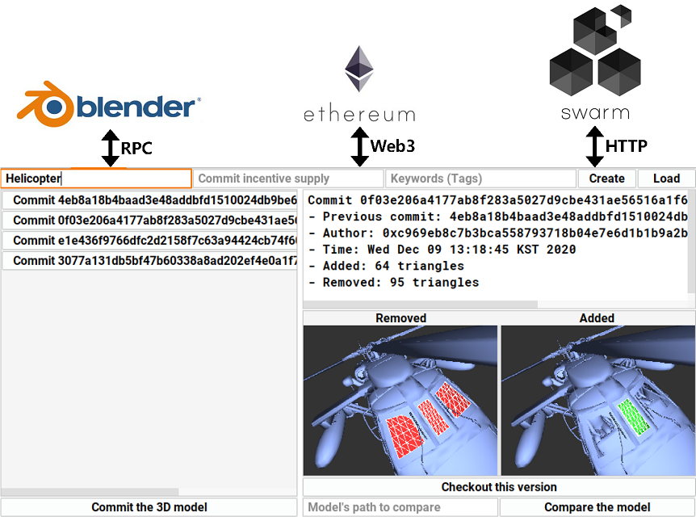
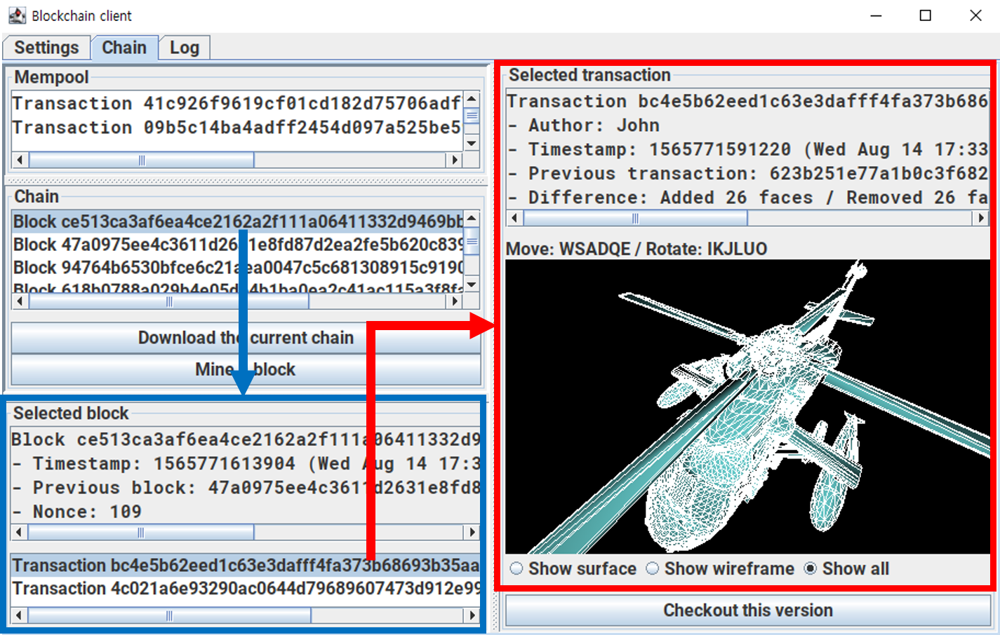

# Hunmin Park

## 🧑‍💼 Careers

Researcher (2021.03 ~)

- ToOffice
- SuperUX

## 🎨 Projects

### SeeMe (2022.01 ~ 2022.06)

- Recruitment service for people with disabilities  
  장애인을 위한 채용 사이트
- Developed for [TimeBanks Korea](http://www.timebanks.or.kr/)  
  [타임뱅크](http://www.timebanks.or.kr/) 측 요청으로 개발
- [Code](https://github.com/volunteer-project-1/volunteer_client)

### SuperUX (2021.06 ~ 2022.xx)

- Drag-and-drop based app creation program  
  드래그 앤 드롭 기반 앱 제작 프로그램

### ToOffice (2021.03 ~ 2021.05)

- Office suite for Windows and TmaxOS  
  윈도우 및 TmaxOS 환경을 위한 오피스 프로그램

### MeowPlayLive (2021.07 ~ 2021.11)

- Interaction game for cat and streamer + Donation & chat system for viewers  
  고양이와 스트리머를 위한 상호작용 게임 + 시청자를 위한 도네이션 및 채팅 시스템
- [Code](https://github.com/cheeeunahn/meowplaylive)

### MeshChain (2020.01 ~ 2021.01)

- 3D model and intellectual property management system based on decentralized technologies  
  탈중앙화 기술 기반의 3D 모델 및 지적 재산권 관리 시스템
- [Code](https://github.com/Avantgarde95/MeshChain-publish)

### C3DMB (2018.12 ~ 2020.04)

- 3D modeling collaboration system based on blockchain  
  블록체인 기반 3D 모델링 협업 시스템
- [Code](https://github.com/Avantgarde95/C3DMB)

## 🏫 Education
- KAIST - M.S. in School of Computing (2013 ~ 2018)
- KAIST - B.S. in School of Computing and Department of Mathematical Sciences (2018 ~ 2021)

## 📖 Research
- [Collaborative 3D modeling system based on blockchain](https://avantgarde95.github.io/C3DMB/)
  - Hunmin Park and Sung-Eui Yoon
  - [Code](https://github.com/Avantgarde95/C3DMB)
  - Pacific Graphics, 2019 (Poster)
- MeshChain: Secure 3D model and intellectual property management powered by blockchain technology
  - [Code](https://github.com/Avantgarde95/MeshChain-publish)
  - Presented at: [CGI (Computer Graphics International) 2021](http://www.cgs-network.org/cgi21/program/)
  - Published at: [Springer LNCS (Lecture Notes in Computer Science)](https://link.springer.com/chapter/10.1007/978-3-030-89029-2_40)
