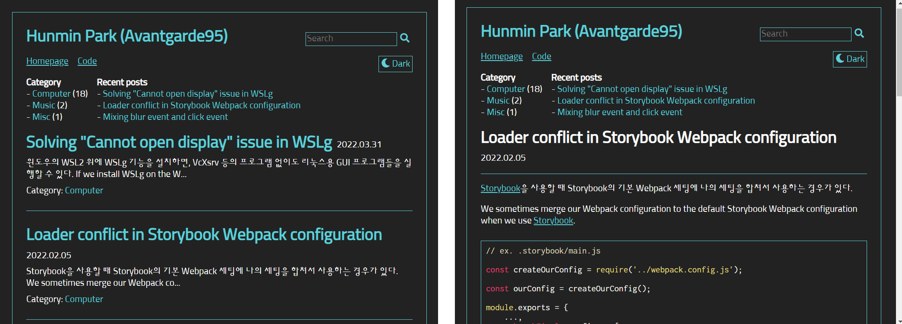

### See English version at [here](English.md)!

## 🖥️ 주요 기술

|Technology|About|
|--|--|
||필요한 UI들을 구현할 수 있습니다. 여러 사람이 사용하는 공통 컴포넌트 구현 경험이 있습니다. Hook들과 외부 상태 관리 도구들을 적절히 사용하여 컴포넌트들을 관리할 수 있습니다.  |
||최신, 그리고 이전 문법에 모두 익숙합니다. DOM API 및 그밖의 브라우저 API들을 사용할 수 있습니다.|
||웹 관련 개발 시에 적극적으로 사용하고 있습니다. Union, intersection, generics 등을 이용하여 확장성 있고 안전한 인터페이스를 설계할 수 있습니다.|
||필요한 레이아웃과 효과들을 만들어 낼 수 있습니다. 애니메이션 사용에도 익숙합니다. CSS modules, SCSS, CSS-in-JS 등을 활용하여 효율적으로 스타일을 작성하는 것을 선호합니다.  ![Emotion](https://img.shields.io/badge/Emotion-C346A8?style=for-the-badge&logo=data:image/png;base64,iVBORw0KGgoAAAANSUhEUgAAABQAAAAUCAYAAACNiR0NAAAAAXNSR0IArs4c6QAAAARnQU1BAACxjwv8YQUAAAAJcEhZcwAADsMAAA7DAcdvqGQAAARlSURBVDhPdZRrbFNlGMf/59Lbabeu3UrXrRubsG7sXqVgAkNFmBNYFi9BISEGNUqMErN4+UDwgxE/gMagqMEL0RhJTMShAY0ajG7GOQSWXUq3zq6zq3SM9d61PT3tOZ4dTqq14ZecvG+e93n+5/++73MOgVtw8qnj5U1E/WkVqeoCAZ6n+BmW4n4KKG98tPfoEy45rYhbCn722MevdmjXHib+l5KjeD6qTnw4khl78aXjh+JyOE+R4NTUFDH75tjRLCv0U6DJGt2q4iQxkGJYl1PwdO9/44BfjkpQ8phnW/rOZ+uU1tdKFAzhjHkQYVNQkBQYWiVn3ETB0SaDQr+zfWP76e9+/yElh0HKYx4TbTy4MvICjztalqFqOIfJuA/u2H+MiA4JpVi6zDe2U01H5KhEgeCxY0d1CoFuWJkvJJdgqA4AzQZk3WEEkyH40ouI55ZBqigIHI9YSeoaG8088N4zb1klAZECQYqgqZVLWMxcR1j7K1y6MELvdqI5WALKG4E/dxkLbBDJZAqCAjAL5VWzpP8VRYLeJ0sUCva/0B/lwCVY42+wrP8DXw9YUOVLSmuOvouwbxlEgp7CSGQYS6kwiAzQUmNTTdDTH0hJIkVnKBDwKg0B/LVgQYhzY3zTJJLqOMatZcgQClyITGMmOodIKgE2mxH3Q1BvnzoRlMuLBTM8N/rLQifquUfQU9eAezv64NxJoKfRhWbHNnRvpGBzBCWHaYKDN+YbkkslitpmTVXjo51lqVa15yp0P67BUFUUTz58BiZ1GprsBNrqFmEui2DYSUFFmL7Yc2L/O3KpRIHDgzue74klUrtvXCuH/1I1Bvt02PPQWWiFBKLJf9ubEKdh8eKG58eW5FCevODTuw/UCJywl6XZM/5YGKN2HvfvOIvK7CKuDAhwngPioZuiV92lQMgGZLHvuQcPVkpBmfyWLzsvxTpbOobVrOYwRdIGVktjQqGG3fQ3atfmULE6C62BwJezTbg8eI/YMjrcoIOHCJ7QX3SPXJVlCs9ww7qNjtqK+u7JrZ0mt60SgbQR80skzLxfbGwKX7nrcIrfj+vbN0FvKMeWTJlBaaaOfDv8/c3eEik4Q7ve5vA2V6tIs0nQtLWBrLZie6Ub6xtzaK3nsb4iAIYhQTIMfGYGMxrCYY4bT8rlEnmHr7/8ydaWrNmumw+VVDt9xlWuOVW6xgyKDKKrYhZK8csY9FuwyHVh87lRdIzNww4LSmlt7d1d9xlzZuXI9LSTzTtU55SP5xhdv8PQtKVDv7bUtszgrm8mMDfeCk+4BH5x66NTm7H5wgxu582w2qehpdWIkoTWx2Z2dVs3MCs6eYdqZcYUr63Z1cqWQkOpxL7TQ00pobkewwwHzPnV0P/ZhHX61ahQl4o/Bhe4aD1+jk3g/JVPqQSTen9y0hmXBHt7e83XQoGBUMCr4RvXwcZqpZesOGDEx7tAIxe04DaVFRbGKK0RkSo4+TDOj3+OWCahUSiUYY/HM/QPnwGrCh3ur7kAAAAASUVORK5CYII=&logoColor=FFFFFF)|
||원하는 개발 & 빌드 환경을 세팅할 수 있습니다. 어플리케이션 뿐만 아니라 라이브러리 세팅 경험도 있습니다.|
||윈도우, 리눅스 등 다양한 환경을 타겟으로 개발하고 빌드할 수 있습니다. 함수 오버로딩, 템플릿 등을 활용하여 코드 중복을 최소화하는 것을 선호합니다.  |

## 🎨 주요 프로젝트

### SeeMe (2022.01 ~ 2022.06)

장애인과 기업들을 연결하는 채용 사이트

[타임뱅크코리아](http://www.timebanks.or.kr/)의 제안으로 시작하게 된 재능기부성 프로젝트입니다. 프론트엔드 개발자 2명, 백엔드 개발자 2명, 디자이너 2명이 모여 진행하였습니다.

서비스는 현재 아래와 같은 기능들을 제공하고 있습니다. 기관과 QA를 진행하고 추가 기능을 기획 & 개발하는 중입니다.

- 구직자로 로그인
  - 이력서 편집
  - 회사들 정보 보기
- 회사로 로그인
  - 회사 정보 편집
  - 채용 정보 편집
  - 구직자 목록 보기
- 공통 기능
  - 미디어 뉴스
  - 고객센터

<strong>My role</strong>

로그인 & 회원가입 페이지를 구현하였으며, 이력서 & 회사 정보 편집, 구직자 & 회사 정보 열람 등 상세 페이지들 개발을 맡았습니다. 또한 랜딩 페이지 일부분에 참여하였습니다.

<strong>Technologies</strong>

- TypeScript
- SCSS
- React
- Redux Toolkit
- Next.js
- [react-scoped-css](https://github.com/gaoxiaoliangz/react-scoped-css)
  - For Vue-like [scoped CSS](https://vue-loader.vuejs.org/guide/scoped-css.html)
- [MUI (Material UI)](https://mui.com/)
  - For implementing modals easily
- [Serverless](https://github.com/serverless-nextjs/serverless-next.js)
  - For deployment
- GitHub actions
  - For automatic deployment

### Tmax SuperUX (2021.06 ~)

No-code 앱 개발 프로그램

<strong>My role</strong>

개발 & 빌드 환경 세팅 및 관리를 전담하였습니다. 프로젝트에서 사용하는 기본 클래스들 및 공통 컴포넌트들의 개발을 주로 맡았습니다. 사용자가 view들을 합성하여 새로운 view를 만드는 기능을 개발하였습니다. 이 프로젝트 및 다른 프로젝트에서 사용하는 공통 라이브러리의 개발도 맡았습니다.

<strong>Technologies</strong>

- TypeScript
- SCSS
- React
- MobX
- React Router
- i18next
  - For resource loading and internalization
- axios
- Webpack
- MUI
- Jest
- Storybook
- ESLint
- StyleLint
- Electron
  - For generating a desktop application

### MeowPlayLive (2021.07 ~ 2021.11)

고양이 방송 시청자와 고양이가 상호작용하는 웹 인터페이스

[DIS 2022](https://dis.acm.org/2022/)에서 발표된 논문 [MeowPlayLive: Enhancing Animal Live Streaming Experience Through Voice Message-Based Real-Time Viewer-Animal Interaction](https://dl.acm.org/doi/abs/10.1145/3532106.3533553)을 위하여 제작하였습니다.

두 명이서 진행한 프로젝트이며 (저와 1저자), 위 논문에 실을 실험을 위하여 제작하였습니다. 아래와 같은 기능들을 제공합니다.

- 고양이를 위한 인터페이스
  - 고양이를 위한 터치 게임
- 시청자를 위한 인터페이스
  - 터치 게임 실시간 보기
  - 자신의 음성을 녹음하고 포인트를 소비하여 고양이에게 보내기
  - 사용한 포인트에 따른 랭킹
  - 시청자들 간의 채팅 기능

![Emotion](https://img.shields.io/badge/Emotion-C346A8?style=for-the-badge&logo=data:image/png;base64,iVBORw0KGgoAAAANSUhEUgAAABQAAAAUCAYAAACNiR0NAAAAAXNSR0IArs4c6QAAAARnQU1BAACxjwv8YQUAAAAJcEhZcwAADsMAAA7DAcdvqGQAAARlSURBVDhPdZRrbFNlGMf/59Lbabeu3UrXrRubsG7sXqVgAkNFmBNYFi9BISEGNUqMErN4+UDwgxE/gMagqMEL0RhJTMShAY0ajG7GOQSWXUq3zq6zq3SM9d61PT3tOZ4dTqq14ZecvG+e93n+5/++73MOgVtw8qnj5U1E/WkVqeoCAZ6n+BmW4n4KKG98tPfoEy45rYhbCn722MevdmjXHib+l5KjeD6qTnw4khl78aXjh+JyOE+R4NTUFDH75tjRLCv0U6DJGt2q4iQxkGJYl1PwdO9/44BfjkpQ8phnW/rOZ+uU1tdKFAzhjHkQYVNQkBQYWiVn3ETB0SaDQr+zfWP76e9+/yElh0HKYx4TbTy4MvICjztalqFqOIfJuA/u2H+MiA4JpVi6zDe2U01H5KhEgeCxY0d1CoFuWJkvJJdgqA4AzQZk3WEEkyH40ouI55ZBqigIHI9YSeoaG8088N4zb1klAZECQYqgqZVLWMxcR1j7K1y6MELvdqI5WALKG4E/dxkLbBDJZAqCAjAL5VWzpP8VRYLeJ0sUCva/0B/lwCVY42+wrP8DXw9YUOVLSmuOvouwbxlEgp7CSGQYS6kwiAzQUmNTTdDTH0hJIkVnKBDwKg0B/LVgQYhzY3zTJJLqOMatZcgQClyITGMmOodIKgE2mxH3Q1BvnzoRlMuLBTM8N/rLQifquUfQU9eAezv64NxJoKfRhWbHNnRvpGBzBCWHaYKDN+YbkkslitpmTVXjo51lqVa15yp0P67BUFUUTz58BiZ1GprsBNrqFmEui2DYSUFFmL7Yc2L/O3KpRIHDgzue74klUrtvXCuH/1I1Bvt02PPQWWiFBKLJf9ubEKdh8eKG58eW5FCevODTuw/UCJywl6XZM/5YGKN2HvfvOIvK7CKuDAhwngPioZuiV92lQMgGZLHvuQcPVkpBmfyWLzsvxTpbOobVrOYwRdIGVktjQqGG3fQ3atfmULE6C62BwJezTbg8eI/YMjrcoIOHCJ7QX3SPXJVlCs9ww7qNjtqK+u7JrZ0mt60SgbQR80skzLxfbGwKX7nrcIrfj+vbN0FvKMeWTJlBaaaOfDv8/c3eEik4Q7ve5vA2V6tIs0nQtLWBrLZie6Ub6xtzaK3nsb4iAIYhQTIMfGYGMxrCYY4bT8rlEnmHr7/8ydaWrNmumw+VVDt9xlWuOVW6xgyKDKKrYhZK8csY9FuwyHVh87lRdIzNww4LSmlt7d1d9xlzZuXI9LSTzTtU55SP5xhdv8PQtKVDv7bUtszgrm8mMDfeCk+4BH5x66NTm7H5wgxu582w2qehpdWIkoTWx2Z2dVs3MCs6eYdqZcYUr63Z1cqWQkOpxL7TQ00pobkewwwHzPnV0P/ZhHX61ahQl4o/Bhe4aD1+jk3g/JVPqQSTen9y0hmXBHt7e83XQoGBUMCr4RvXwcZqpZesOGDEx7tAIxe04DaVFRbGKK0RkSo4+TDOj3+OWCahUSiUYY/HM/QPnwGrCh3ur7kAAAAASUVORK5CYII=&logoColor=FFFFFF)

<strong>My role</strong>

녹음하고 보내기 기능, 채팅 기능, 랭킹 기능을 구현하였습니다. 또한 팀원이 P5.js로 구현한 UI들을 React에 부착하는 작업을 하였습니다. 서버 및 DB를 팀원과 같이 개발하였습니다.

<strong>Technologies</strong>

- TypeScript
- React
- Emotion
- MUI
- Node.js
- Express
- Socket.io
  - Enables server to notify the clients
  - Necessary for implementing chat, etc.
- [NeDB](https://github.com/louischatriot/nedb)
- Webpack
- [p5.js](https://p5js.org/)

### MeshChain (2020.01 ~ 2021.01)

탈중앙화 기술 기반의 3D 모델 및 지적 재산권 관리 시스템

[CGI 2021](http://www.cgs-network.org/cgi21/program/)에서 발표된 논문 [MeshChain: Secure 3D model and intellectual property management powered by blockchain technology](https://link.springer.com/chapter/10.1007/978-3-030-89029-2_40)를 위하여 제작하였습니다. 1인 제작이며, 아래와 같은 기능들을 제공합니다.

- 모델링 도구(Blender)에서 3D 모델 불러오기
- 3D 모델 수정 내역을 탈중앙화 네트워크에 저장 ('Commit')
- 수정 내역으로부터 3D 모델을 불러와서 모델링 도구에 반영 ('Checkout')
- 네트워크 상의 수정 내역들을 GUI 상에 보여주기
- Commit 시마다 저자에게 자동으로 인센티브 계산하여 지급
- 저장된 3D 모델과 외부 3D 모델의 유사도 계산

<strong>Technologies</strong>

- Kotlin
- Swing
  - GUI framework
- JOGL (OpenGL)
  - For 3D rendering
- Web3
- Ethereum (Geth)
- Solidity
- [Swarm](https://github.com/ethersphere/swarm)
  - For storing large data
- Blender
- JavaScript

## 📘 기타 프로젝트들

<strong>lets-style</strong>

직접 구현해본 CSS-in-JS 라이브러리

<strong>mypage</strong>

React 및 반응형 레이아웃 공부 목적으로 제작한 개인 홈페이지

가상의 스마트폰이라는 컨셉을 가지고 있습니다.

![Emotion](https://img.shields.io/badge/Emotion-C346A8?style=for-the-badge&logo=data:image/png;base64,iVBORw0KGgoAAAANSUhEUgAAABQAAAAUCAYAAACNiR0NAAAAAXNSR0IArs4c6QAAAARnQU1BAACxjwv8YQUAAAAJcEhZcwAADsMAAA7DAcdvqGQAAARlSURBVDhPdZRrbFNlGMf/59Lbabeu3UrXrRubsG7sXqVgAkNFmBNYFi9BISEGNUqMErN4+UDwgxE/gMagqMEL0RhJTMShAY0ajG7GOQSWXUq3zq6zq3SM9d61PT3tOZ4dTqq14ZecvG+e93n+5/++73MOgVtw8qnj5U1E/WkVqeoCAZ6n+BmW4n4KKG98tPfoEy45rYhbCn722MevdmjXHib+l5KjeD6qTnw4khl78aXjh+JyOE+R4NTUFDH75tjRLCv0U6DJGt2q4iQxkGJYl1PwdO9/44BfjkpQ8phnW/rOZ+uU1tdKFAzhjHkQYVNQkBQYWiVn3ETB0SaDQr+zfWP76e9+/yElh0HKYx4TbTy4MvICjztalqFqOIfJuA/u2H+MiA4JpVi6zDe2U01H5KhEgeCxY0d1CoFuWJkvJJdgqA4AzQZk3WEEkyH40ouI55ZBqigIHI9YSeoaG8088N4zb1klAZECQYqgqZVLWMxcR1j7K1y6MELvdqI5WALKG4E/dxkLbBDJZAqCAjAL5VWzpP8VRYLeJ0sUCva/0B/lwCVY42+wrP8DXw9YUOVLSmuOvouwbxlEgp7CSGQYS6kwiAzQUmNTTdDTH0hJIkVnKBDwKg0B/LVgQYhzY3zTJJLqOMatZcgQClyITGMmOodIKgE2mxH3Q1BvnzoRlMuLBTM8N/rLQifquUfQU9eAezv64NxJoKfRhWbHNnRvpGBzBCWHaYKDN+YbkkslitpmTVXjo51lqVa15yp0P67BUFUUTz58BiZ1GprsBNrqFmEui2DYSUFFmL7Yc2L/O3KpRIHDgzue74klUrtvXCuH/1I1Bvt02PPQWWiFBKLJf9ubEKdh8eKG58eW5FCevODTuw/UCJywl6XZM/5YGKN2HvfvOIvK7CKuDAhwngPioZuiV92lQMgGZLHvuQcPVkpBmfyWLzsvxTpbOobVrOYwRdIGVktjQqGG3fQ3atfmULE6C62BwJezTbg8eI/YMjrcoIOHCJ7QX3SPXJVlCs9ww7qNjtqK+u7JrZ0mt60SgbQR80skzLxfbGwKX7nrcIrfj+vbN0FvKMeWTJlBaaaOfDv8/c3eEik4Q7ve5vA2V6tIs0nQtLWBrLZie6Ub6xtzaK3nsb4iAIYhQTIMfGYGMxrCYY4bT8rlEnmHr7/8ydaWrNmumw+VVDt9xlWuOVW6xgyKDKKrYhZK8csY9FuwyHVh87lRdIzNww4LSmlt7d1d9xlzZuXI9LSTzTtU55SP5xhdv8PQtKVDv7bUtszgrm8mMDfeCk+4BH5x66NTm7H5wgxu582w2qehpdWIkoTWx2Z2dVs3MCs6eYdqZcYUr63Z1cqWQkOpxL7TQ00pobkewwwHzPnV0P/ZhHX61ahQl4o/Bhe4aD1+jk3g/JVPqQSTen9y0hmXBHt7e83XQoGBUMCr4RvXwcZqpZesOGDEx7tAIxe04DaVFRbGKK0RkSo4+TDOj3+OWCahUSiUYY/HM/QPnwGrCh3ur7kAAAAASUVORK5CYII=&logoColor=FFFFFF)

<strong>blog</strong>

React 공부 목적으로 제작한 블로그

Markdown으로 글을 써서 올릴 수 있습니다. 테마 전환, 카테고리, 검색 등의 기능들을 제공하고 있습니다.

![Emotion](https://img.shields.io/badge/Emotion-C346A8?style=for-the-badge&logo=data:image/png;base64,iVBORw0KGgoAAAANSUhEUgAAABQAAAAUCAYAAACNiR0NAAAAAXNSR0IArs4c6QAAAARnQU1BAACxjwv8YQUAAAAJcEhZcwAADsMAAA7DAcdvqGQAAARlSURBVDhPdZRrbFNlGMf/59Lbabeu3UrXrRubsG7sXqVgAkNFmBNYFi9BISEGNUqMErN4+UDwgxE/gMagqMEL0RhJTMShAY0ajG7GOQSWXUq3zq6zq3SM9d61PT3tOZ4dTqq14ZecvG+e93n+5/++73MOgVtw8qnj5U1E/WkVqeoCAZ6n+BmW4n4KKG98tPfoEy45rYhbCn722MevdmjXHib+l5KjeD6qTnw4khl78aXjh+JyOE+R4NTUFDH75tjRLCv0U6DJGt2q4iQxkGJYl1PwdO9/44BfjkpQ8phnW/rOZ+uU1tdKFAzhjHkQYVNQkBQYWiVn3ETB0SaDQr+zfWP76e9+/yElh0HKYx4TbTy4MvICjztalqFqOIfJuA/u2H+MiA4JpVi6zDe2U01H5KhEgeCxY0d1CoFuWJkvJJdgqA4AzQZk3WEEkyH40ouI55ZBqigIHI9YSeoaG8088N4zb1klAZECQYqgqZVLWMxcR1j7K1y6MELvdqI5WALKG4E/dxkLbBDJZAqCAjAL5VWzpP8VRYLeJ0sUCva/0B/lwCVY42+wrP8DXw9YUOVLSmuOvouwbxlEgp7CSGQYS6kwiAzQUmNTTdDTH0hJIkVnKBDwKg0B/LVgQYhzY3zTJJLqOMatZcgQClyITGMmOodIKgE2mxH3Q1BvnzoRlMuLBTM8N/rLQifquUfQU9eAezv64NxJoKfRhWbHNnRvpGBzBCWHaYKDN+YbkkslitpmTVXjo51lqVa15yp0P67BUFUUTz58BiZ1GprsBNrqFmEui2DYSUFFmL7Yc2L/O3KpRIHDgzue74klUrtvXCuH/1I1Bvt02PPQWWiFBKLJf9ubEKdh8eKG58eW5FCevODTuw/UCJywl6XZM/5YGKN2HvfvOIvK7CKuDAhwngPioZuiV92lQMgGZLHvuQcPVkpBmfyWLzsvxTpbOobVrOYwRdIGVktjQqGG3fQ3atfmULE6C62BwJezTbg8eI/YMjrcoIOHCJ7QX3SPXJVlCs9ww7qNjtqK+u7JrZ0mt60SgbQR80skzLxfbGwKX7nrcIrfj+vbN0FvKMeWTJlBaaaOfDv8/c3eEik4Q7ve5vA2V6tIs0nQtLWBrLZie6Ub6xtzaK3nsb4iAIYhQTIMfGYGMxrCYY4bT8rlEnmHr7/8ydaWrNmumw+VVDt9xlWuOVW6xgyKDKKrYhZK8csY9FuwyHVh87lRdIzNww4LSmlt7d1d9xlzZuXI9LSTzTtU55SP5xhdv8PQtKVDv7bUtszgrm8mMDfeCk+4BH5x66NTm7H5wgxu582w2qehpdWIkoTWx2Z2dVs3MCs6eYdqZcYUr63Z1cqWQkOpxL7TQ00pobkewwwHzPnV0P/ZhHX61ahQl4o/Bhe4aD1+jk3g/JVPqQSTen9y0hmXBHt7e83XQoGBUMCr4RvXwcZqpZesOGDEx7tAIxe04DaVFRbGKK0RkSo4+TDOj3+OWCahUSiUYY/HM/QPnwGrCh3ur7kAAAAASUVORK5CYII=&logoColor=FFFFFF)

<strong>C3DMB</strong>

블록체인 기반 3D 모델링 협업 시스템

논문 [Collaborative 3D modeling system based on blockchain](https://avantgarde95.github.io/C3DMB/)을 위하여 제작하였습니다.

<strong>Technologies</strong>

- Kotlin
- Swing
- JOGL (OpenGL)
- Blender

<strong>Tmax ToOffice</strong>

윈도우 및 TmaxOS 환경을 위한 오피스 프로그램

<strong>My role</strong>

제품에 체험판 기능을 개발하여 넣었습니다. 편집기 부분의 라이브러리화 작업에 참여하였으며, 그에 필요한 UI 수정, 통신 기능 부여 및 데이터 처리를 맡았습니다. 해당 라이브러리의 개발 문서를 작성하였습니다.

<strong>Technologies</strong>

- C++
- WinAPI

## 🧑‍💼 경력

### [TmaxOffice](https://www.tmax.co.kr/tmaxoffice) 연구원 (2021.03 ~)

데스크톱 오피스 제품 ToOffice의 유지보수 및 기능 추가에 참여하였으며, no-code 앱 개발 플랫폼 SuperUX의 개발에 참여하였습니다.

## 🏫 학력

KAIST 전산학부 석사 (2018 ~ 2021)

KAIST 전산학부 및 수리과학과 학사 (복수전공) (2013 ~ 2018)

## 📖 연구

### Collaborative 3D modeling system based on blockchain

*Hunmin Park and Sung-Eui Yoon*

<strong>Abstract</strong>

We propose a collaborative 3D modeling system, which is based on the blockchain technology. Our approach uses the blockchain to communicate with modeling tools and to provide them a decentralized database of the mesh modification history. This approach also provides a server-less version control system: users can commit their modifications to the blockchain and checkout others' modifications from the blockchain. As a result, our system enables users to do collaborative modeling without any central server.

- [Homepage](https://avantgarde95.github.io/C3DMB/)
- [Code](https://github.com/Avantgarde95/C3DMB)
- Presented at: [Pacific Graphics, 2019 (Poster)](http://pg19.org/)

### MeshChain: Secure 3D model and intellectual property management powered by blockchain technology

*Hunmin Park, Yuchi Huo and Sung-Eui Yoon*

<strong>Abstract</strong>

The intellectual value of digitized 3D properties in scientific, artistic, historical, and entertaining domains is increasing. However, there has been less attention on designing an immutable, secure database for their management. We propose a secure 3D property management platform powered by blockchain and decentralized storage. The platform connects various 3D modeling tools to a decentralized network-based database constructed on blockchain and decentralized storage technologies and provides the commit and checkout of the 3D model to that network. This structure provides 3D data protection from damages and attacks, intellectual property (IP) management, and data source authentication. We analyze its performance and show its applications to cooperative 3D modeling and IP management.

- [Code](https://github.com/Avantgarde95/MeshChain-publish)
- Presented at: [CGI (Computer Graphics International) 2021](http://www.cgs-network.org/cgi21/program/)
- Published at: [Springer LNCS (Lecture Notes in Computer Science)](https://link.springer.com/chapter/10.1007/978-3-030-89029-2_40)
