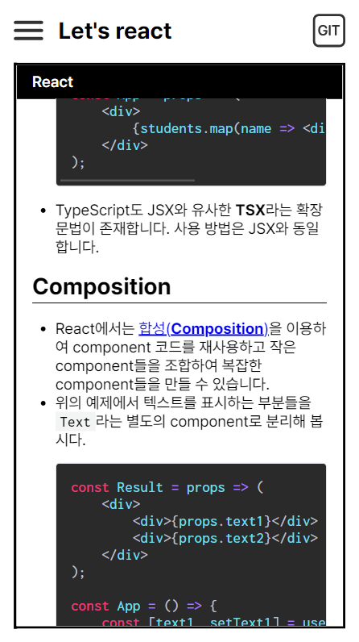
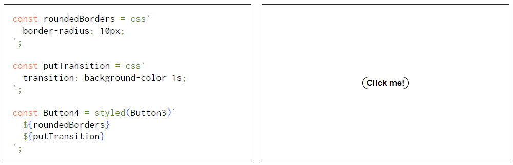
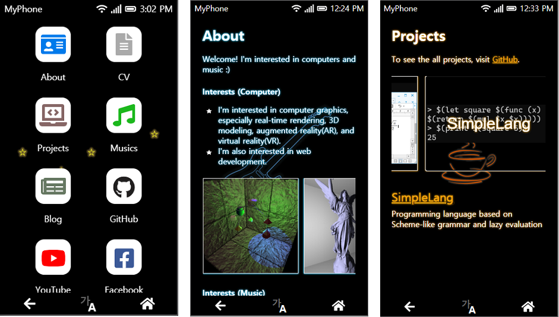
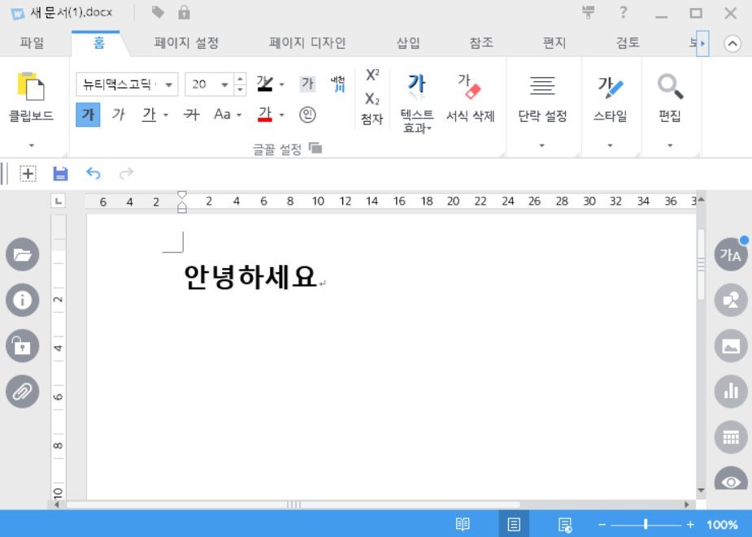

### <ko>See English version at [here](English.md)!</ko><en>[여기서](README.md) 한국어 버전을 보실 수 있습니다!</en>

## 🖥️ <ko>주요 기술</ko><en>Main technologies</en>

|Technology|About|
|--|--|
|<react/>|<ko>필요한 UI들을 구현할 수 있습니다. 여러 사람이 사용하는 공통 컴포넌트 구현 경험이 있습니다. Hook들과 외부 상태 관리 도구들을 적절히 사용하여 컴포넌트들을 관리할 수 있습니다.</ko><en>I can implement the UIs we need. I have experience implementing common components used by multiple people. I can manage the components by using the hooks and external state management tools properly.</en>  <redux/><mobx/><mui/><next/>|
|<js/>|<ko>최신, 그리고 이전 문법에 모두 익숙합니다. DOM API 및 그밖의 브라우저 API들을 사용할 수 있습니다.</ko><en>I'm familiar with both the latest and the old versions of JavaScript. I can use DOM APIs and other browser APIs, too.</en>|
|<ts/>|<ko>웹 관련 개발 시에 적극적으로 사용하고 있습니다. Union, intersection, generics 등을 이용하여 확장성 있고 안전한 인터페이스를 설계할 수 있습니다.</ko><en>I'm using it actively in web development. I can construct extendable and safe interfaces using union, intersection, generics, etc.</en>|
|<css/>|<ko>필요한 레이아웃과 효과들을 만들어 낼 수 있습니다. 애니메이션 사용에도 익숙합니다. CSS modules, SCSS, CSS-in-JS 등을 활용하여 효율적으로 스타일을 작성하는 것을 선호합니다.</ko><en>I can create the layouts and effects we need. I am familiar with animations, too. I prefer to use the methods such as CSS modules, SCSS, or CSS-in-JS to write the styles efficiently.</en>  <scss/><emotion/>|
|<webpack/>|<ko>원하는 개발 & 빌드 환경을 세팅할 수 있습니다. 어플리케이션 뿐만 아니라 라이브러리 세팅 경험도 있습니다.</ko><en>I can construct development & build environment I need. I have experience in setting up not only applications but also libraries.</en>|
|<cpp/>|<ko>윈도우, 리눅스 등 다양한 환경을 타겟으로 개발하고 빌드할 수 있습니다. 함수 오버로딩, 템플릿 등을 활용하여 코드 중복을 최소화하는 것을 선호합니다.</ko><en>I can develop and build the application for various environments such as Windows and Linux. I prefer to minimize code duplications by utilizing function overloading, templates, etc.</en>  <opengl/>|

## 🎨 <ko>주요 프로젝트</ko><en>Featured projects</en>

### SeeMe (2022.01 ~ 2022.06)

<ko>
장애인과 기업들을 연결하는 채용 사이트
</ko>
<en>
Recruitment service for people with disabilities
</en>

<ko>
[타임뱅크코리아](http://www.timebanks.or.kr/)의 제안으로 시작하게 된 재능기부성 프로젝트입니다. 프론트엔드 개발자 2명, 백엔드 개발자 2명, 디자이너 2명이 모여 진행하였습니다.

서비스는 현재 아래와 같은 기능들을 제공하고 있습니다. 기관과 QA를 진행하고 추가 기능을 기획 & 개발하는 중입니다.

- 구직자로 로그인
  - 이력서 편집
  - 회사들 정보 보기
- 회사로 로그인
  - 회사 정보 편집
  - 채용 정보 편집
  - 구직자 목록 보기
- 공통 기능
  - 미디어 뉴스
  - 고객센터
</ko>
<en>
This is a talent donation project started from the proposal of [TimeBanks Korea](http://www.timebanks.or.kr/). The project is run by a team of 2 frontend developers, 2 backend developers, and 2 designers.

The service currently provides the following features. We are doing QA with the organization and planning & developing additional features.

- Login as job seeker
  - Edit resume
  - See companies' information
- Login as company
  - Edit company information
  - Edit job information
  - See job seekers' information
- Common
  - Media news
  - FAQ
</en>

<strong>My role</strong>

<ko>
로그인 & 회원가입 페이지를 구현하였으며, 이력서 & 회사 정보 편집, 구직자 & 회사 정보 열람 등 상세 페이지들 개발을 맡았습니다. 또한 랜딩 페이지 일부분에 참여하였습니다.
</ko>
<en>
I implemented login & registration page, and also developed inner pages such as resume & company info editor, job seeker & company info viewer. I also participated in some parts of the landing page.
</en>

[<project-run/>](https://d3lfsar2p3k0ag.cloudfront.net/)
[<project-code/>](https://github.com/volunteer-project-1/volunteer_client)

<ts/><scss/><react/><redux/><next/><aws/>

### Tmax SuperUX (2021.06 ~)

<ko>
No-code 앱 개발 프로그램
</ko>
<en>
No-code app development program
</en>

<ko>
오피스와 유사한 사용자 경험으로 앱을 개발하기 위한 데스크톱 어플리케이션입니다.
</ko>
<en>
It is a desktop application for developing apps with an user experience similar to the office programs.
</en>

<strong>My role</strong>

<ko>
개발 & 빌드 & 테스트 환경 세팅 및 관리를 전담하였습니다. 프로젝트에서 사용하는 기본 클래스들 및 공통 컴포넌트들의 개발을 주로 맡았습니다. 사용자가 view들을 합성하여 새로운 view를 만드는 기능을 개발하였습니다. 이 프로젝트 및 다른 프로젝트에서 사용하는 공통 라이브러리(내부용 npm 패키지)의 개발도 맡았습니다.
</ko>
<en>
I setup and maintained development & build & test environment of the project. I was mainly responsible for the development of the base classes and common components used throughout the project. I created a feature for users to create new views by composing existing views. I also developed a common library (private npm package) used by this project and other projects.
</en>

<ts/><scss/><react/><mobx/><electron/><webpack/><jest/><storybook/>

### MeowPlayLive (2021.07 ~ 2021.11)

<ko>
고양이 방송 시청자와 고양이가 상호작용하는 웹 인터페이스
</ko>
<en>
Web interface that enables cat live stream viewers to interact with the cat
</en>

<ko>
[DIS 2022](https://dis.acm.org/2022/)에서 발표된 논문 [MeowPlayLive: Enhancing Animal Live Streaming Experience Through Voice Message-Based Real-Time Viewer-Animal Interaction](https://dl.acm.org/doi/abs/10.1145/3532106.3533553)을 위하여 제작하였습니다.

두 명이서 진행한 프로젝트이며 (저와 1저자), 위 논문에 실을 실험을 위하여 제작하였습니다. 아래와 같은 기능들을 제공합니다.

- 고양이를 위한 인터페이스
  - 고양이를 위한 터치 게임
- 시청자를 위한 인터페이스
  - 터치 게임 실시간 보기
  - 자신의 음성을 녹음하고 포인트를 소비하여 고양이에게 보내기
  - 사용한 포인트에 따른 랭킹
  - 시청자들 간의 채팅 기능
</ko>
<en>
Created for the paper [MeowPlayLive: Enhancing Animal Live Streaming Experience Through Voice Message-Based Real-Time Viewer-Animal Interaction](https://dl.acm.org/doi/abs/10.1145/3532106.3533553) presented at [DIS 2022](https://dis.acm.org/2022/).

This project was carried out by two people (Me and lead author), and it was created for the experiment to be used in the above paper. It provides the following features.

- Interface for the cat
  - Touch game for the cat
- Interface for the viewer
  - See the progress of the game in real time
  - Record the viewer's voice and sending it to the cat after spending some points
  - Ranking according to the amount of spent points
  - Chat between the viewers
</en>

<strong>My role</strong>

<ko>
녹음하고 보내기 기능, 채팅 기능, 랭킹 기능을 구현하였습니다. 또한 팀원이 P5.js로 구현한 UI들을 React에 부착하는 작업을 하였습니다. 서버 및 DB를 팀원과 같이 개발하였습니다.
</ko>
<en>
I implemented the recording & sending UI, chat UI, and ranking UI. In addition, I attached P5.js-based UIs implemented by other member to React. I and the other member developed the server and DB together.
</en>

[<project-code/>](https://github.com/cheeeunahn/meowplaylive)

<ts/><js/><react/><emotion/><socketio/><node/>

### lets-react (2021.06)

<ko>
React로 구현한 React 튜토리얼
</ko>
<en>
React tutorial written in React
</en>

<ko>
회사에서 웹 기반 제품을 개발할 때 웹을 처음 접했던 팀원들을 위하여 제작하였습니다. 제품 개발에 쓰인 기술 스택들에 대한 기본적인 내용을 담고 있습니다. 각 아티클에, 설명들 뿐만 아니라 CodeSandbox를 embed하여 만든 라이브 데모들도 존재합니다.
</ko>
<en>
When we started developing web-based products at the company, I created this website for team members who were new to the web. It contains the basics of the technology stacks used in our product. There are live demos on the articles made by embedding CodeSandbox as well as explanations.
</en>

[<project-run/>](https://avantgarde95.github.io/lets-react/)
[<project-code/>](https://github.com/Avantgarde95/lets-react)

<ts/><react/><scss/><webpack/>

### MeshChain (2020.01 ~ 2021.01)

<ko>
탈중앙화 기술 기반의 3D 모델 및 지적 재산권 관리 시스템
</ko>
<en>
3D model and intellectual property management system based on decentralized technologies
</en>

<ko>
[CGI 2021](http://www.cgs-network.org/cgi21/program/)에서 발표된 논문 [MeshChain: Secure 3D model and intellectual property management powered by blockchain technology](https://link.springer.com/chapter/10.1007/978-3-030-89029-2_40)를 위하여 제작하였습니다. 1인 제작이며, 아래와 같은 기능들을 제공합니다.

- 모델링 도구(Blender)에서 3D 모델 불러오기
- 3D 모델 수정 내역을 탈중앙화 네트워크에 저장 ('Commit')
- 수정 내역으로부터 3D 모델을 불러와서 모델링 도구에 반영 ('Checkout')
- 네트워크 상의 수정 내역들을 GUI 상에 보여주기
- Commit 시마다 저자에게 자동으로 인센티브 계산하여 지급
- 저장된 3D 모델과 외부 3D 모델의 유사도 계산
</ko>
<en>
Created for the paper [MeshChain: Secure 3D model and intellectual property management powered by blockchain technology](https://link.springer.com/chapter/10.1007/978-3-030-89029-2_40) presented at [CGI 2021](http://www.cgs-network.org/cgi21/program/). This is implemented by myself. The program provides the following features.

- Import 3D model from modeling tool (Blender)
- Saving 3D model revision history in a decentralized network ('Commit')
- Import the 3D model from the revision history and apply it to the modeling tool ('Checkout')
- Display history on the GUI
- Calculate incentives and pay those to authors for each commit
- Calculate similarity between saved 3D model and external 3D model
</en>

[<project-code/>](https://github.com/Avantgarde95/MeshChain-publish)

<kotlin/><js/><python/><ethereum/><solidity/><opengl/>

## 📘 <ko>기타 프로젝트들</ko><en>Other projects</en>

<strong>lets-style</strong>
<ko>
직접 구현해본 CSS-in-JS 라이브러리
</ko>
<en>
My own implementation of CSS-in-JS library
</en>

<ko>
Emotion, styled-components 등의 CSS-in-JS 라이브러리들을 사용하면서, 비슷한 라이브러리를 직접 구현해보며 해당 방식에 대해 깊이 이해하고자 만들었습니다. 해당 라이브러리들과 유사한 API를 제공하고, 같은 원리로 작동합니다.
</ko>
<en>
While using CSS-in-JS libraries such as Emotion and styled-components, I tried to implement a similar library myself to understand that method in depth. It provides APIs similar to those of these libraries, and operates on the same principle.
</en>

[<project-run/>](https://lets-style.vercel.app/)
[<project-code/>](https://github.com/Avantgarde95/lets-style)

<ts/><react/><css/>

<strong>mypage</strong>
<ko>
개인 홈페이지
</ko>
<en>
My homepage
</en>

<ko>
React를 공부하기 위해 제작하였습니다. 가상의 스마트폰이라는 컨셉을 가지고 있습니다. Webpack, React, Emotion 등의 사용, 그리드, 리스트 등의 레이아웃 구현, 모바일 대응 등의 경험을 쌓았습니다.
</ko>
<en>
I created this for studying React. It has a concept of 'virtual smartphone'.
I gained experience of using Webpack, React, Emotion, etc., and implementing layouts such as grids and lists, and handling mobile devices.
</en>

[<project-run/>](https://avantgarde95.github.io/)
[<project-code/>](https://github.com/Avantgarde95/Avantgarde95.github.io)

<ts/><react/><emotion/><webpack/>

<strong>C3DMB</strong>
<ko>
블록체인 기반 3D 모델링 협업 시스템
</ko>
<en>
3D modeling collaboration system based on blockchain
</en>

<ko>
논문 [Collaborative 3D modeling system based on blockchain](https://avantgarde95.github.io/C3DMB/)을 위하여 제작하였습니다. 아래와 같은 기능들을 제공합니다.

- PoW 방식의 간단한 블록체인
- 블록체인의 상태를 GUI 상에 보여주기
- 모델링 도구(Blender)에서 3D 모델을 읽어서 블록체인 네트워크에 올리기
- 블록체인에서 3D 모델을 다운받아 모델링 도구에 반영하기
</ko>
<en>
Created for the paper [Collaborative 3D modeling system based on blockchain](https://avantgarde95.github.io/C3DMB/). It provides the following features.

- Simple PoW-based blockchain
- Display blockchain's state on the GUI
- Read 3D model from the modeling tool (Blender) and upload on the blockchain network
- Download 3D model from the blockchain and apply to the modeling tool
</en>

[<project-code/>](https://github.com/Avantgarde95/C3DMB)

<kotlin/><python/><opengl/>

<strong>Tmax ToOffice</strong>
<ko>
윈도우 및 TmaxOS 환경을 위한 오피스 프로그램
</ko>
<en>
Office suite for Windows and TmaxOS
</en>

<ko>
제품에 체험판 기능을 개발하여 넣었습니다. 편집기 부분의 라이브러리화 작업에 참여하였으며, 그에 필요한 UI 수정, 통신 기능 부여 및 데이터 처리를 맡았습니다. 해당 라이브러리의 개발 문서를 작성하였습니다.
</ko>
<en>
I created trial mode for the product. I participated in separation of the editor part as a library: I was responsible for the UI modification, communication feature development and data processing needed for that job. I wrote the development documentation for that library.
</en>

<cpp/><winapi/>

## 🧑‍💼 <ko>경력</ko><en>Careers</en>

### [TmaxOffice](https://www.tmax.co.kr/tmaxoffice) <ko>연구원</ko><en>Researcher</en> (2021.03 ~)

<ko>
데스크톱 오피스 제품 ToOffice의 유지보수 및 기능 추가에 참여하였으며, no-code 앱 개발 플랫폼 SuperUX의 개발에 참여하였습니다.
</ko>
<en>
I participated in maintaining the desktop office product ToOffice and adding some features on it, and participated in the development of the no-code app development platform SuperUX.
</en>

## 🏫 <ko>학력</ko><en>Education</en>

KAIST <ko>전산학부 석사</ko><en>M.S. in School of Computing</en> (2018 ~ 2021)

KAIST <ko>전산학부 및 수리과학과 학사 (복수전공)</ko><en>B.S. in School of Computing and Department of Mathematical Sciences (Double major)</en> (2013 ~ 2018)

## 📖 <ko>연구</ko><en>Research</en>

### Collaborative 3D modeling system based on blockchain

*Hunmin Park and Sung-Eui Yoon*

<strong>Abstract</strong>

We propose a collaborative 3D modeling system, which is based on the blockchain technology. Our approach uses the blockchain to communicate with modeling tools and to provide them a decentralized database of the mesh modification history. This approach also provides a server-less version control system: users can commit their modifications to the blockchain and checkout others' modifications from the blockchain. As a result, our system enables users to do collaborative modeling without any central server.

- [Homepage](https://avantgarde95.github.io/C3DMB/)
- [Code](https://github.com/Avantgarde95/C3DMB)
- Presented at: [Pacific Graphics, 2019 (Poster)](http://pg19.org/)

### MeshChain: Secure 3D model and intellectual property management powered by blockchain technology

*Hunmin Park, Yuchi Huo and Sung-Eui Yoon*

<strong>Abstract</strong>

The intellectual value of digitized 3D properties in scientific, artistic, historical, and entertaining domains is increasing. However, there has been less attention on designing an immutable, secure database for their management. We propose a secure 3D property management platform powered by blockchain and decentralized storage. The platform connects various 3D modeling tools to a decentralized network-based database constructed on blockchain and decentralized storage technologies and provides the commit and checkout of the 3D model to that network. This structure provides 3D data protection from damages and attacks, intellectual property (IP) management, and data source authentication. We analyze its performance and show its applications to cooperative 3D modeling and IP management.

- [Code](https://github.com/Avantgarde95/MeshChain-publish)
- Presented at: [CGI (Computer Graphics International) 2021](http://www.cgs-network.org/cgi21/program/)
- Published at: [Springer LNCS (Lecture Notes in Computer Science)](https://link.springer.com/chapter/10.1007/978-3-030-89029-2_40)
