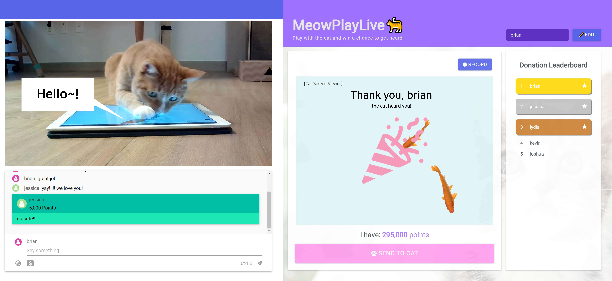
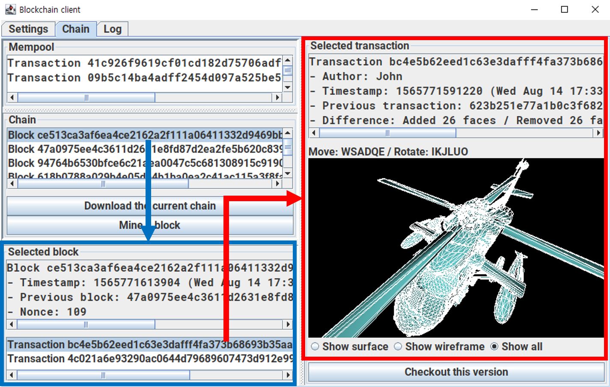

### <ko>See English version at [here](English.md)!</ko><en>[여기서](README.md) 한국어 버전을 보실 수 있습니다!</en>

## 🖥️ <ko>주요 기술</ko><en>Main technologies</en>

|Technology|About|
|--|--|
|<react/>|<ko>필요한 UI들을 구현할 수 있습니다. 여러 사람이 사용하는 공통 컴포넌트 구현 경험이 있습니다. Hook들과 외부 상태 관리 도구들을 적절히 사용하여 컴포넌트들을 관리할 수 있습니다.</ko><en>I can implement the UIs we need. I have experience implementing common components used by multiple people. I can manage the components by using the hooks and external state management tools properly.</en>  <redux/><mobx/><mui/><next/><router/>|
|<js/>|<ko>최신, 그리고 이전 문법에 모두 익숙합니다. DOM API 및 그밖의 브라우저 API들을 사용할 수 있습니다.</ko><en>I'm familiar with both the latest and the old versions of JavaScript. I can use DOM APIs and other browser APIs, too.</en>|
|<ts/>|<ko>웹 관련 개발 시에 적극적으로 사용하고 있습니다. Union, intersection, generics 등을 이용하여 확장성 있고 안전한 인터페이스를 설계할 수 있습니다.</ko><en>I'm using it actively in web development. I can construct extendable and safe interfaces using union, intersection, generics, etc.</en>|
|<css/>|<ko>필요한 레이아웃과 효과들을 만들어 낼 수 있습니다. 애니메이션 사용에도 익숙합니다. CSS modules, SCSS, CSS-in-JS 등을 활용하여 효율적으로 스타일을 작성하는 것을 선호합니다.</ko><en>I can create the layouts and effects we need. I am familiar with animations, too. I prefer to use the methods such as CSS modules, SCSS, or CSS-in-JS to write the styles efficiently.</en>  <scss/><emotion/>|
|<webpack/>|<ko>원하는 개발 & 빌드 환경을 세팅할 수 있습니다. 어플리케이션 뿐만 아니라 라이브러리 세팅 경험도 있습니다.</ko><en>I can construct development & build environment I need. I have experience in setting up not only applications but also libraries.</en>|
|<cpp/>|<ko>윈도우, 리눅스 등 다양한 환경을 타겟으로 개발하고 빌드할 수 있습니다. 함수 오버로딩, 템플릿 등을 활용하여 코드 중복을 최소화하는 것을 선호합니다.</ko><en>I can develop and build the application for various environments such as Windows and Linux. I prefer to minimize code duplications by utilizing function overloading, templates, etc.</en>  <opengl/>|

## 🎨 <ko>프로젝트</ko><en>Projects</en>

### SeeMe (2022.01 ~ 2022.06)

<ko>
장애인을 위한 채용 사이트

[타임뱅크코리아](http://www.timebanks.or.kr/)를 위하여 개발하였습니다.
</ko>
<en>
Recruitment service for people with disabilities

Created for [TimeBanks Korea](http://www.timebanks.or.kr/).
</en>

[<project-code/>](https://github.com/volunteer-project-1/volunteer_client)

<ts/><scss/><react/><redux/><mui/><next/><aws/>

<strong>Technologies</strong>

- TypeScript
- SCSS
- React
- Redux Toolkit
- Next.js
- [react-scoped-css](https://github.com/gaoxiaoliangz/react-scoped-css)
  - For Vue-like [scoped CSS](https://vue-loader.vuejs.org/guide/scoped-css.html)
- [MUI (Material UI)](https://mui.com/)
  - For implementing modals easily
- [Serverless](https://github.com/serverless-nextjs/serverless-next.js)
  - For deployment
- GitHub actions
  - For automatic deployment

<strong>Features</strong>

For all users 모든 사용자

- Landing page 랜딩 페이지
- Media news page 미디어 뉴스 페이지
- FAQ page FAQ 페이지

For job seekers 구직자

- Resume editor page 이력서 편집 페이지
- Company list page 회사 목록 페이지

For companies 회사

- Company info editor page 회사 정보 편집 페이지
- Job info editor page 채용 정보 편집 페이지
- Seeker list page 구직자 목록 페이지

<strong>Results</strong>

- Delivered the prototype to the organization and performed QA process  
  기관 측에 프로토타입 전달 및 QA 진행
- Gained experience of developing website with many pages  
  많은 페이지를 가진 웹사이트 개발 경험을 얻음

### Tmax SuperUX (2021.06 ~)

<ko>
No-code 앱 개발 프로그램
</ko>
<en>
No-code app development program
</en>

<ts/><scss/><react/><router/><mobx/><mui/><electron/><webpack/><jest/><storybook/>

<strong>Technologies</strong>

- TypeScript
- SCSS
- React
- MobX
- React Router
- i18next
  - For resource loading and internalization
- axios
- Webpack
- MUI
- Jest
- Storybook
- ESLint
- StyleLint
- Electron
  - For generating a desktop application

### Tmax ToOffice (2021.03 ~ 2021.05)

<ko>
윈도우 및 TmaxOS 환경을 위한 오피스 프로그램
</ko>
<en>
Office suite for Windows and TmaxOS
</en>

<cpp/><winapi/>

<strong>Technologies</strong>

- C++
- WinAPI

### MeowPlayLive (2021.07 ~ 2021.11)

<ko>
고양이 방송 시청자가 방송 속의 고양이와 상호작용할 수 있게 해주는 웹 인터페이스

[DIS 2022](https://dis.acm.org/2022/)에서 발표된 논문 [MeowPlayLive: Enhancing Animal Live Streaming Experience Through Voice Message-Based Real-Time Viewer-Animal Interaction](https://dl.acm.org/doi/abs/10.1145/3532106.3533553)을 위하여 제작하였습니다.
</ko>
<en>
Web interface that enables cat live stream viewers to interact with the cat in the video

Created for the paper [MeowPlayLive: Enhancing Animal Live Streaming Experience Through Voice Message-Based Real-Time Viewer-Animal Interaction](https://dl.acm.org/doi/abs/10.1145/3532106.3533553) presented at [DIS 2022](https://dis.acm.org/2022/).
</en>

[<project-code/>](https://github.com/cheeeunahn/meowplaylive)

<ts/><react/><emotion/><mui/><socketio/><node/>

<strong>Technologies</strong>

- TypeScript
- React
- Emotion
- MUI
- Node.js
- Express
- Socket.io
  - Enables server to notify the clients
  - Necessary for implementing chat, etc.
- [NeDB](https://github.com/louischatriot/nedb)
- Webpack
- [p5.js](https://p5js.org/)

### MeshChain (2020.01 ~ 2021.01)

<ko>
탈중앙화 기술 기반의 3D 모델 및 지적 재산권 관리 시스템

[CGI 2021](http://www.cgs-network.org/cgi21/program/)에서 발표된 논문 [MeshChain: Secure 3D model and intellectual property management powered by blockchain technology](https://link.springer.com/chapter/10.1007/978-3-030-89029-2_40)를 위하여 제작하였습니다.
</ko>
<en>
3D model and intellectual property management system based on decentralized technologies

Created for the paper [MeshChain: Secure 3D model and intellectual property management powered by blockchain technology](https://link.springer.com/chapter/10.1007/978-3-030-89029-2_40) presented at [CGI 2021](http://www.cgs-network.org/cgi21/program/).
</en>

[<project-code/>](https://github.com/Avantgarde95/MeshChain-publish)

<kotlin/><js/><python/><ethereum/><solidity/><opengl/>

<strong>Technologies</strong>

- Kotlin
- Swing
  - GUI framework
- JOGL (OpenGL)
  - For 3D rendering
- Web3
- Ethereum (Geth)
- Solidity
- [Swarm](https://github.com/ethersphere/swarm)
  - For storing large data
- Blender
- JavaScript

### C3DMB (2018.12 ~ 2020.04)

<ko>
블록체인 기반 3D 모델링 협업 시스템

논문 [Collaborative 3D modeling system based on blockchain](https://avantgarde95.github.io/C3DMB/)를 위하여 제작하였습니다.
</ko>
<en>
3D modeling collaboration system based on blockchain

Created for the paper [Collaborative 3D modeling system based on blockchain](https://avantgarde95.github.io/C3DMB/).
</en>

[<project-code/>](https://github.com/Avantgarde95/C3DMB)

<kotlin/><python/><opengl/>

<strong>Technologies</strong>

- Kotlin
- Swing
- JOGL (OpenGL)
- Blender

## 🧑‍💼 <ko>경력</ko><en>Careers</en>

### [TmaxOffice](https://www.tmax.co.kr/tmaxoffice) <ko>연구원</ko><en>Researcher</en> (2021.03 ~)

<ko>
데스크톱 오피스 제품 ToOffice의 유지보수 및 기능 추가에 참여하였으며, no-code 앱 개발 플랫폼 SuperUX의 개발에 참여하였습니다.
</ko>
<en>
I participated in maintaining the desktop office product ToOffice and adding some features on it, and participated in the development of the no-code app development platform SuperUX.
</en>

## 🏫 <ko>학력</ko><en>Education</en>

KAIST <ko>전산학부 석사</ko><en>M.S. in School of Computing</en> (2018 ~ 2021)

KAIST <ko>전산학부 및 수리과학과 학사 (복수전공)</ko><en>B.S. in School of Computing and Department of Mathematical Sciences (Double major)</en> (2013 ~ 2018)

## 📖 <ko>연구</ko><en>Research</en>

### Collaborative 3D modeling system based on blockchain

*Hunmin Park and Sung-Eui Yoon*

<strong>Abstract</strong>

We propose a collaborative 3D modeling system, which is based on the blockchain technology. Our approach uses the blockchain to communicate with modeling tools and to provide them a decentralized database of the mesh modification history. This approach also provides a server-less version control system: users can commit their modifications to the blockchain and checkout others' modifications from the blockchain. As a result, our system enables users to do collaborative modeling without any central server.

- [Homepage](https://avantgarde95.github.io/C3DMB/)
- [Code](https://github.com/Avantgarde95/C3DMB)
- Presented at: [Pacific Graphics, 2019 (Poster)](http://pg19.org/)

### MeshChain: Secure 3D model and intellectual property management powered by blockchain technology

*Hunmin Park, Yuchi Huo and Sung-Eui Yoon*

<strong>Abstract</strong>

The intellectual value of digitized 3D properties in scientific, artistic, historical, and entertaining domains is increasing. However, there has been less attention on designing an immutable, secure database for their management. We propose a secure 3D property management platform powered by blockchain and decentralized storage. The platform connects various 3D modeling tools to a decentralized network-based database constructed on blockchain and decentralized storage technologies and provides the commit and checkout of the 3D model to that network. This structure provides 3D data protection from damages and attacks, intellectual property (IP) management, and data source authentication. We analyze its performance and show its applications to cooperative 3D modeling and IP management.

- [Code](https://github.com/Avantgarde95/MeshChain-publish)
- Presented at: [CGI (Computer Graphics International) 2021](http://www.cgs-network.org/cgi21/program/)
- Published at: [Springer LNCS (Lecture Notes in Computer Science)](https://link.springer.com/chapter/10.1007/978-3-030-89029-2_40)
